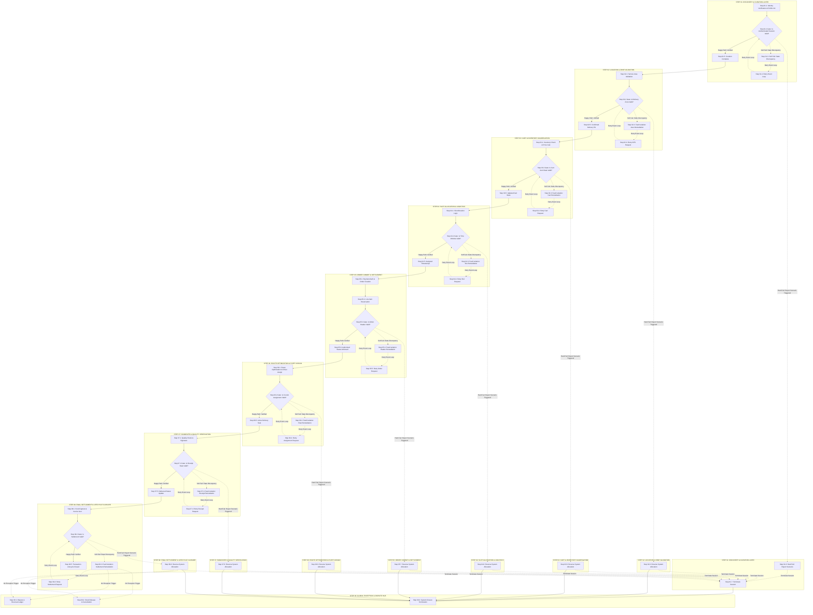

```mermaid
graph TD
    subgraph phase_01_a ["STEP 01: DISCOVERY & CURATION LAYER"]
        node_entry["Step 01.1: Identity Verification & Profile Init"]
        node_discover_gate{"Step 01.2 Gate: Is Authenticated Session Valid?"}
        node_discover_fail["Step 01.3: Soft Fail: State Discrepancy"]
        node_discover_recover["Step 01.4: Retry Event Loop"]
        node_discover_exit["Step 01.5: Curation Complete"]
    end

    subgraph phase_01_b ["STEP 01: DISCOVERY & CURATION LAYER"]
        node_discover_reject["Step 01.6: Hard Fail: Reject Scenario"]
        node_discover_close["Step 01.7: Terminate Session"]
    end

    node_entry --> node_discover_gate
    node_discover_gate -- " Happy Path: Verified " --> node_discover_exit
    node_discover_gate -. "Soft Fail: State Discrepancy" .-> node_discover_fail
    node_discover_fail -. "Retry Event Loop" .-> node_discover_recover
    node_discover_recover -. "Retry Event Loop" .-> node_discover_gate
    node_discover_gate -. "Hard Fail: Reject Scenario Triggered" .-> node_discover_reject
    node_discover_reject -. "Terminate Session" .-> node_discover_close

    subgraph phase_02_a ["STEP 02: LOCATION & ZONE VALIDATION"]
        node_loc_input["Step 02.1: Service Area Validation"]
        node_loc_gate{"Step 02.2 Gate: Is Delivery Zone Valid?"}
        node_loc_alert["Step 02.3: Fault Isolation: Auto-Remediation"]
        node_loc_retry["Step 02.4: Retry GPS Request"]
        node_loc_exit["Step 02.5: Confirmed Delivery Pin"]
    end

    subgraph phase_02_b ["STEP 02: LOCATION & ZONE VALIDATION"]
        node_loc_reject["Step 02.6: Reverse System Allocation"]
    end

    node_discover_exit --> node_loc_input
    node_loc_input --> node_loc_gate
    node_loc_gate -- " Happy Path: Verified " --> node_loc_exit
    node_loc_gate -. "Soft Fail: State Discrepancy" .-> node_loc_alert
    node_loc_alert -. "Retry Event Loop" .-> node_loc_retry
    node_loc_retry -. "Retry Event Loop" .-> node_loc_gate
    node_loc_gate -. "Hard Fail: Reject Scenario Triggered" .-> node_loc_reject
    node_loc_reject -. "Terminate Session" .-> node_discover_close

    subgraph phase_03_a ["STEP 03: CART & INVENTORY AGGREGATION"]
        node_cart_input["Step 03.1: Inventory Check & Price Calc"]
        node_cart_gate{"Step 03.2 Gate: Is Cart Item State Valid?"}
        node_cart_alert["Step 03.3: Fault Isolation: Cart Remediation"]
        node_cart_retry["Step 03.4: Retry Cart Request"]
        node_cart_exit["Step 03.5: Updated Cart State"]
    end

    subgraph phase_03_b ["STEP 03: CART & INVENTORY AGGREGATION"]
        node_cart_reject["Step 03.6: Reverse System Allocation"]
    end

    node_loc_exit --> node_cart_input
    node_cart_input --> node_cart_gate
    node_cart_gate -- " Happy Path: Verified " --> node_cart_exit
    node_cart_gate -. "Soft Fail: State Discrepancy" .-> node_cart_alert
    node_cart_alert -. "Retry Event Loop" .-> node_cart_retry
    node_cart_retry -. "Retry Event Loop" .-> node_cart_gate
    node_cart_gate -. "Hard Fail: Reject Scenario Triggered" .-> node_cart_reject
    node_cart_reject -. "Terminate Session" .-> node_discover_close

    subgraph phase_04_a ["STEP 04: SLOT ALLOCATION & LOGISTICS"]
        node_slot_input["Step 04.1: Slot Allocation Logic"]
        node_slot_gate{"Step 04.2 Gate: Is Time Window Valid?"}
        node_slot_alert["Step 04.3: Fault Isolation: Slot Remediation"]
        node_slot_retry["Step 04.4: Retry Slot Request"]
        node_slot_exit["Step 04.5: Assigned Timestamps"]
    end

    subgraph phase_04_b ["STEP 04: SLOT ALLOCATION & LOGISTICS"]
        node_slot_reject["Step 04.6: Reverse System Allocation"]
    end

    node_cart_exit --> node_slot_input
    node_slot_input --> node_slot_gate
    node_slot_gate -- " Happy Path: Verified " --> node_slot_exit
    node_slot_gate -. "Soft Fail: State Discrepancy" .-> node_slot_alert
    node_slot_alert -. "Retry Event Loop" .-> node_slot_retry
    node_slot_retry -. "Retry Event Loop" .-> node_slot_gate
    node_slot_gate -. "Hard Fail: Reject Scenario Triggered" .-> node_slot_reject
    node_slot_reject -. "Terminate Session" .-> node_discover_close

    subgraph phase_05_a ["STEP 05: ORDER COMMIT & SETTLEMENT"]
        node_order_input["Step 05.1: Payment Auth & Order Creation"]
        node_order_line["Step 05.2: Line Item Reservation"]
        node_order_gate{"Step 05.3 Gate: Is Order Header Valid?"}
        node_order_alert["Step 05.4: Fault Isolation: Header Remediation"]
        node_order_retry["Step 05.5: Retry Order Request"]
        node_order_exit["Step 05.6: Authorized Status Achieved"]
    end

    subgraph phase_05_b ["STEP 05: ORDER COMMIT & SETTLEMENT"]
        node_order_reject["Step 05.7: Reverse System Allocation"]
    end

    node_slot_exit --> node_order_input
    node_order_input --> node_order_line
    node_order_line --> node_order_gate
    node_order_gate -- " Happy Path: Verified " --> node_order_exit
    node_order_gate -. "Soft Fail: State Discrepancy" .-> node_order_alert
    node_order_alert -. "Retry Event Loop" .-> node_order_retry
    node_order_retry -. "Retry Event Loop" .-> node_order_gate
    node_order_gate -. "Hard Fail: Reject Scenario Triggered" .-> node_order_reject
    node_order_reject -. "Terminate Session" .-> node_discover_close

    subgraph phase_06_a ["STEP 06: ROUTE OPTIMIZATION & FLEET ASSIGN"]
        node_route_input["Step 06.1: Route Optimization & Driver Assign"]
        node_route_gate{"Step 06.2 Gate: Is Courier Assignment Valid?"}
        node_route_alert["Step 06.3: Fault Isolation: Fleet Remediation"]
        node_route_retry["Step 06.4: Retry Assignment Request"]
        node_route_exit["Step 06.5: Active Delivery Task"]
    end

    subgraph phase_06_b ["STEP 06: ROUTE OPTIMIZATION & FLEET ASSIGN"]
        node_route_reject["Step 06.6: Reverse System Allocation"]
    end

    node_order_exit --> node_route_input
    node_route_input --> node_route_gate
    node_route_gate -- " Happy Path: Verified " --> node_route_exit
    node_route_gate -. "Soft Fail: State Discrepancy" .-> node_route_alert
    node_route_alert -. "Retry Event Loop" .-> node_route_retry
    node_route_retry -. "Retry Event Loop" .-> node_route_gate
    node_route_gate -. "Hard Fail: Reject Scenario Triggered" .-> node_route_reject
    node_route_reject -. "Terminate Session" .-> node_discover_close

    subgraph phase_07_a ["STEP 07: HANDOVER & QUALITY VERIFICATION"]
        node_handover_input["Step 07.1: Quality Check & Signature"]
        node_handover_gate{"Step 07.2 Gate: Is Receipt State Valid?"}
        node_handover_alert["Step 07.3: Fault Isolation: Receipt Remediation"]
        node_handover_retry["Step 07.4: Retry Receipt Request"]
        node_handover_exit["Step 07.5: Delivered Status Update"]
    end

    subgraph phase_07_b ["STEP 07: HANDOVER & QUALITY VERIFICATION"]
        node_handover_reject["Step 07.6: Reverse System Allocation"]
    end

    node_route_exit --> node_handover_input
    node_handover_input --> node_handover_gate
    node_handover_gate -- " Happy Path: Verified " --> node_handover_exit
    node_handover_gate -. "Soft Fail: State Discrepancy" .-> node_handover_alert
    node_handover_alert -. "Retry Event Loop" .-> node_handover_retry
    node_handover_retry -. "Retry Event Loop" .-> node_handover_gate
    node_handover_gate -. "Hard Fail: Reject Scenario Triggered" .-> node_handover_reject
    node_handover_reject -. "Terminate Session" .-> node_discover_close

    subgraph phase_08_a ["STEP 08: FINAL SETTLEMENT & LIFECYCLE CLOSURE"]
        node_final_input["Step 08.1: Fund Capture & Invoice Gen"]
        node_final_gate{"Step 08.2 Gate: Is Settlement Valid?"}
        node_final_alert["Step 08.3: Fault Isolation: Settlement Remediation"]
        node_final_retry["Step 08.4: Retry Settlement Request"]
        node_final_exit["Step 08.5: Transaction Lifecycle Closed"]
    end

    subgraph phase_08_b ["STEP 08: FINAL SETTLEMENT & LIFECYCLE CLOSURE"]
        node_final_reject["Step 08.6: Reverse System Allocation"]
    end

    node_handover_exit --> node_final_input
    node_final_input --> node_final_gate
    node_final_gate -- " Happy Path: Verified " --> node_final_exit
    node_final_gate -. "Soft Fail: State Discrepancy" .-> node_final_alert
    node_final_alert -. "Retry Event Loop" .-> node_final_retry
    node_final_retry -. "Retry Event Loop" .-> node_final_gate
    node_final_gate -. "Hard Fail: Reject Scenario Triggered" .-> node_final_reject
    node_final_reject -. "Terminate Session" .-> node_discover_close

    subgraph phase_09_closure ["STEP 09: GLOBAL EXCEPTION & DISPUTE HUB"]
        node_dispute_hub["Step 09.1: Dispute & Reversal Ledger"]
        node_cancel_hub["Step 09.2: Stock Release & Cancellation"]
        node_terminal_close["Step 09.3: System Closure Termination"]
    end

    node_discover_close --> node_terminal_close
    node_loc_reject --> node_terminal_close
    node_cart_reject --> node_terminal_close
    node_slot_reject --> node_terminal_close
    node_order_reject --> node_terminal_close
    node_route_reject --> node_terminal_close
    node_handover_reject --> node_terminal_close
    node_final_reject --> node_terminal_close
    node_final_alert -. "On Exception Trigger" .-> node_dispute_hub
    node_final_alert -. "On Exception Trigger" .-> node_cancel_hub
    node_final_reject -. "On Exception Trigger" .-> node_dispute_hub
    node_final_reject -. "On Exception Trigger" .-> node_cancel_hub
```