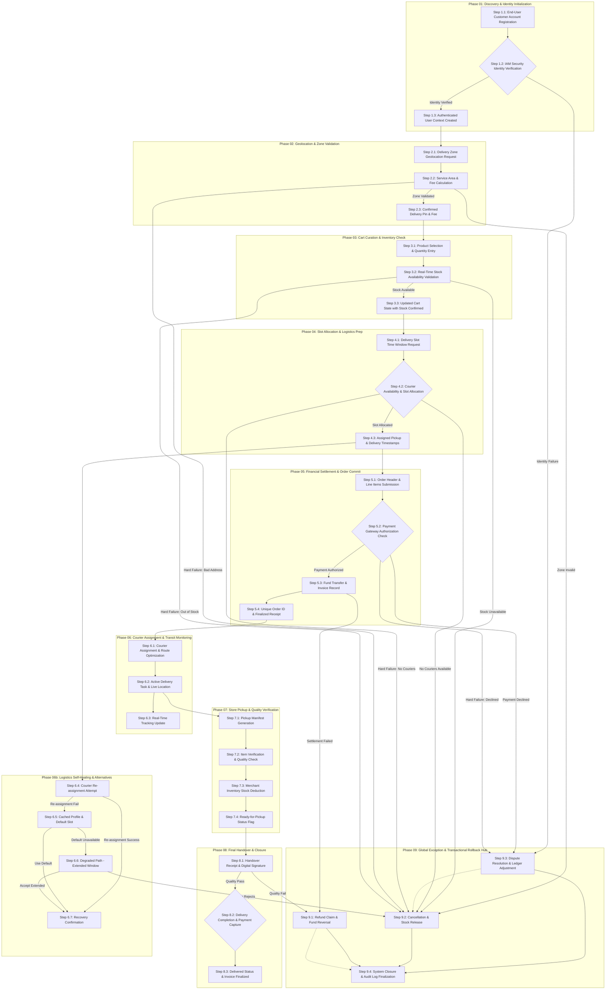

```mermaid
graph TD
    subgraph phase_init["Phase 01: Discovery & Identity Initialization"]
        dir_phase01_entrance["Step 1.1: End-User Customer Account Registration"]
        iam_gate_phase01{"Step 1.2: IAM Security Identity Verification"}
        user_profile["Step 1.3: Authenticated User Context Created"]
    end
    
    subgraph phase_loc["Phase 02: Geolocation & Zone Validation"]
        dir_phase02_entrance["Step 2.1: Delivery Zone Geolocation Request"]
        loc_service["Step 2.2: Service Area & Fee Calculation"]
        loc_phase02_exit["Step 2.3: Confirmed Delivery Pin & Fee"]
    end
    
    subgraph phase_cart["Phase 03: Cart Curation & Inventory Check"]
        dir_phase03_entrance["Step 3.1: Product Selection & Quantity Entry"]
        stock_check["Step 3.2: Real-Time Stock Availability Validation"]
        cart_state["Step 3.3: Updated Cart State with Stock Confirmed"]
    end
    
    subgraph phase_slot["Phase 04: Slot Allocation & Logistics Prep"]
        dir_phase04_entrance["Step 4.1: Delivery Slot Time Window Request"]
        dispatcher_check{"Step 4.2: Courier Availability & Slot Allocation"}
        slot_assigned["Step 4.3: Assigned Pickup & Delivery Timestamps"]
    end
    
    subgraph phase_pay["Phase 05: Financial Settlement & Order Commit"]
        order_header["Step 5.1: Order Header & Line Items Submission"]
        pay_gateway{"Step 5.2: Payment Gateway Authorization Check"}
        payment_processed["Step 5.3: Fund Transfer & Invoice Record"]
        order_final["Step 5.4: Unique Order ID & Finalized Receipt"]
    end
    
    subgraph phase_transit["Phase 06: Courier Assignment & Transit Monitoring"]
        courier_assign["Step 6.1: Courier Assignment & Route Optimization"]
        courier_active["Step 6.2: Active Delivery Task & Live Location"]
        transit_phase06_exit["Step 6.3: Real-Time Tracking Update"]
    end
    
    subgraph phase_fulfill["Phase 07: Store Pickup & Quality Verification"]
        manifest_gen["Step 7.1: Pickup Manifest Generation"]
        item_verify["Step 7.2: Item Verification & Quality Check"]
        stock_update["Step 7.3: Merchant Inventory Stock Deduction"]
        ready_pickup["Step 7.4: Ready-for-Pickup Status Flag"]
    end
    
    subgraph phase_handover["Phase 08: Final Handover & Closure"]
        handover_sign["Step 8.1: Handover Receipt & Digital Signature"]
        final_capture{"Step 8.2: Delivery Completion & Payment Capture"}
        handover_phase08_exit["Step 8.3: Delivered Status & Invoice Finalized"]
    end
    
    subgraph global_closure["Phase 09: Global Exception & Transactional Rollback Hub"]
        exc_refund["Step 9.1: Refund Claim & Fund Reversal"]
        exc_cancel["Step 9.2: Cancellation & Stock Release"]
        exc_dispute["Step 9.3: Dispute Resolution & Ledger Adjustment"]
        sys_terminal["Step 9.4: System Closure & Audit Log Finalization"]
    end

    %% PHASE 1: INITIALIZATION
    dir_phase01_entrance --> iam_gate_phase01
    iam_gate_phase01 -- "Identity Verified" --> user_profile
    iam_gate_phase01 -- "Identity Failure" --> exc_dispute

    %% PHASE 2: GEOLOCATION
    user_profile --> dir_phase02_entrance
    dir_phase02_entrance --> loc_service
    loc_service -- "Zone Validated" --> loc_phase02_exit
    loc_service -- "Zone Invalid" --> exc_cancel

    %% PHASE 3: CART & INVENTORY
    loc_phase02_exit --> dir_phase03_entrance
    dir_phase03_entrance --> stock_check
    stock_check -- "Stock Available" --> cart_state
    stock_check -- "Stock Unavailable" --> exc_cancel

    %% PHASE 4: SLOT ALLOCATION
    cart_state --> dir_phase04_entrance
    dir_phase04_entrance --> dispatcher_check
    dispatcher_check -- "Slot Allocated" --> slot_assigned
    dispatcher_check -- "No Couriers Available" --> exc_cancel

    %% PHASE 5: PAYMENT & COMMIT
    slot_assigned --> order_header
    order_header --> pay_gateway
    pay_gateway -- "Payment Authorized" --> payment_processed
    pay_gateway -- "Payment Declined" --> exc_dispute
    payment_processed --> order_final
    payment_processed -- "Settlement Failed" --> exc_refund

    %% PHASE 6: TRANSIT
    order_final --> courier_assign
    courier_assign --> courier_active
    courier_active --> transit_phase06_exit

    %% PHASE 7: FULFILLMENT
    courier_active --> manifest_gen
    manifest_gen --> item_verify
    item_verify --> stock_update
    stock_update --> ready_pickup

    %% PHASE 8: HANDOVER
    ready_pickup --> handover_sign
    handover_sign -- "Quality Pass" --> final_capture
    handover_sign -- "Quality Fail" --> exc_refund
    final_capture --> handover_phase08_exit

    %% PHASE 9: EXCEPTION CONVERGENCE
    exc_dispute --> sys_terminal
    exc_cancel --> sys_terminal
    exc_refund --> sys_terminal
    exc_dispute -.-> exc_cancel
    exc_refund -.-> sys_terminal

    %% CROSS-BOUNDARY EXCEPTION ROUTING (Rule 13)
    pay_gateway -- "Hard Failure: Declined" --> exc_dispute
    dispatcher_check -- "Hard Failure: No Couriers" --> exc_cancel
    loc_service -- "Hard Failure: Bad Address" --> exc_cancel
    stock_check -- "Hard Failure: Out of Stock" --> exc_cancel

    %% SUB-PHASE 6.1: SELF-HEALING LOGISTICS (Rule 6.1)
    subgraph phase_transit_heal["Phase 06b: Logistics Self-Healing & Alternatives"]
        slot_reassign["Step 6.4: Courier Re-assignment Attempt"]
        slot_cache["Step 6.5: Cached Profile & Default Slot"]
        slot_degrade["Step 6.6: Degraded Path - Extended Window"]
        heal_phase06_exit["Step 6.7: Recovery Confirmation"]
    end

    %% Link Phase 06b to Phase 06 Main
    slot_assigned --> slot_reassign
    slot_reassign -- "Re-assignment Success" --> heal_phase06_exit
    slot_reassign -- "Re-assignment Fail" --> slot_cache
    slot_cache -- "Use Default" --> heal_phase06_exit
    slot_cache -- "Default Unavailable" --> slot_degrade
    slot_degrade -- "Accept Extended" --> heal_phase06_exit
    slot_degrade -- "User Rejects" --> exc_cancel
```