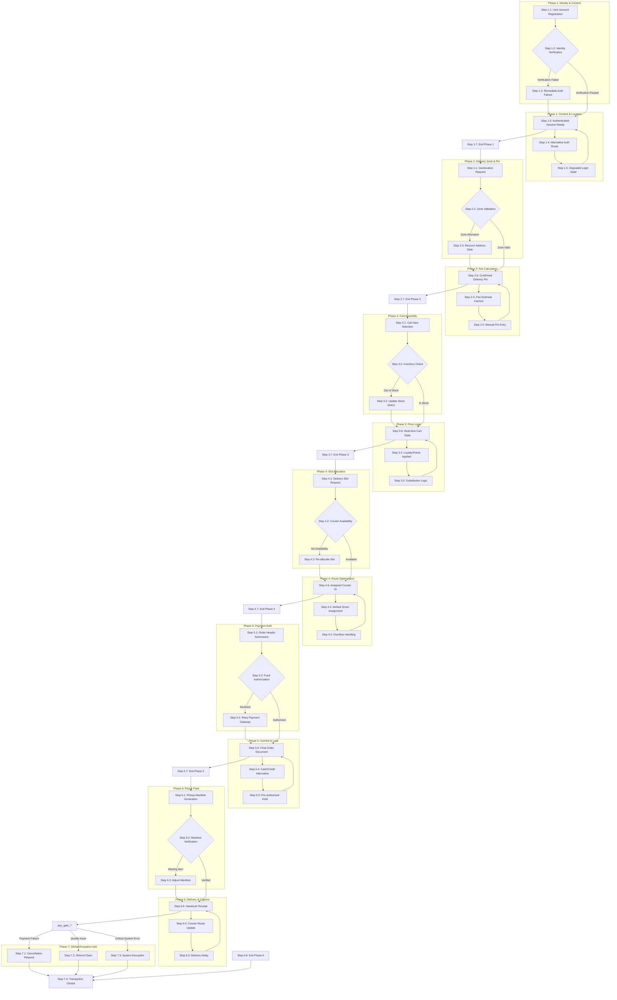

```mermaid
graph TD
    %% ==============================================================================
    %% PHASE 1: USER ONBOARDING & CONTEXT INITIALIZATION
    %% ==============================================================================
    subgraph phase_01_a["Phase 1: Identity & Context"]
        entrance_node_1["Step 1.1: User Account Registration"]
        auth_gate_1{"Step 1.2: Identity Verification"}
        recovery_node_1["Step 1.3: Remediate Auth Failure"]
    end

    subgraph phase_01_b["Phase 1: Context & Location"]
        alt_node_1["Step 1.4: Alternative Auth Route"]
        degraded_node_1["Step 1.5: Degraded Login State"]
        exit_node_1["Step 1.6: Authenticated Session Ready"]
    end

    entrance_node_1 --> auth_gate_1
    auth_gate_1 -- "Verification Failed" --> recovery_node_1
    recovery_node_1 --> exit_node_1
    auth_gate_1 -- "Verification Passed" --> exit_node_1
    exit_node_1 --> alt_node_1
    alt_node_1 --> degraded_node_1
    degraded_node_1 --> exit_node_1
    exit_node_1 --> exit_gateway_node_1

    %% ==============================================================================
    %% PHASE 2: GEOLOCATION & SERVICE AREA VALIDATION
    %% ==============================================================================
    subgraph phase_02_a["Phase 2: Delivery Zone & Pin"]
        entrance_node_2["Step 2.1: Geolocation Request"]
        zone_gate_2{"Step 2.2: Zone Validation"}
        recovery_node_2["Step 2.3: Recover Address Data"]
    end

    subgraph phase_02_b["Phase 2: Fee Calculation"]
        alt_node_2["Step 2.4: Fee Estimate Cached"]
        degraded_node_2["Step 2.5: Manual Pin Entry"]
        exit_node_2["Step 2.6: Confirmed Delivery Pin"]
    end

    exit_gateway_node_1 --> entrance_node_2
    entrance_node_2 --> zone_gate_2
    zone_gate_2 -- "Zone Mismatch" --> recovery_node_2
    recovery_node_2 --> exit_node_2
    zone_gate_2 -- "Zone Valid" --> exit_node_2
    exit_node_2 --> alt_node_2
    alt_node_2 --> degraded_node_2
    degraded_node_2 --> exit_node_2
    exit_node_2 --> exit_gateway_node_2

    %% ==============================================================================
    %% PHASE 3: CART MANAGEMENT & INVENTORY PREVIEW
    %% ==============================================================================
    subgraph phase_03_a["Phase 3: Cart Assembly"]
        entrance_node_3["Step 3.1: Cart Item Selection"]
        stock_gate_3{"Step 3.2: Inventory Check"}
        recovery_node_3["Step 3.3: Update Stock Query"]
    end

    subgraph phase_03_b["Phase 3: Price Logic"]
        alt_node_3["Step 3.4: Loyalty/Points Applied"]
        degraded_node_3["Step 3.5: Substitution Logic"]
        exit_node_3["Step 3.6: Real-time Cart State"]
    end

    exit_gateway_node_2 --> entrance_node_3
    entrance_node_3 --> stock_gate_3
    stock_gate_3 -- "Out of Stock" --> recovery_node_3
    recovery_node_3 --> exit_node_3
    stock_gate_3 -- "In Stock" --> exit_node_3
    exit_node_3 --> alt_node_3
    alt_node_3 --> degraded_node_3
    degraded_node_3 --> exit_node_3
    exit_node_3 --> exit_gateway_node_3

    %% ==============================================================================
    %% PHASE 4: LOGISTICS & SLOT ALLOCATION
    %% ==============================================================================
    subgraph phase_04_a["Phase 4: Slot Allocation"]
        entrance_node_4["Step 4.1: Delivery Slot Request"]
        courier_gate_4{"Step 4.2: Courier Availability"}
        recovery_node_4["Step 4.3: Re-allocate Slot"]
    end

    subgraph phase_04_b["Phase 4: Route Optimization"]
        alt_node_4["Step 4.4: Default Driver Assignment"]
        degraded_node_4["Step 4.5: Overflow Handling"]
        exit_node_4["Step 4.6: Assigned Courier ID"]
    end

    exit_gateway_node_3 --> entrance_node_4
    entrance_node_4 --> courier_gate_4
    courier_gate_4 -- "No Availability" --> recovery_node_4
    recovery_node_4 --> exit_node_4
    courier_gate_4 -- "Available" --> exit_node_4
    exit_node_4 --> alt_node_4
    alt_node_4 --> degraded_node_4
    degraded_node_4 --> exit_node_4
    exit_node_4 --> exit_gateway_node_4

    %% ==============================================================================
    %% PHASE 5: PAYMENT & ORDER FINALIZATION
    %% ==============================================================================
    subgraph phase_05_a["Phase 5: Payment Auth"]
        entrance_node_5["Step 5.1: Order Header Submission"]
        pay_gate_5{"Step 5.2: Fund Authorization"}
        recovery_node_5["Step 5.3: Retry Payment Gateway"]
    end

    subgraph phase_05_b["Phase 5: Commit & Lock"]
        alt_node_5["Step 5.4: Cash/Credit Alternative"]
        degraded_node_5["Step 5.5: Pre-Authorized Hold"]
        exit_node_5["Step 5.6: Final Order Document"]
    end

    exit_gateway_node_4 --> entrance_node_5
    entrance_node_5 --> pay_gate_5
    pay_gate_5 -- "Declined" --> recovery_node_5
    recovery_node_5 --> exit_node_5
    pay_gate_5 -- "Authorized" --> exit_node_5
    exit_node_5 --> alt_node_5
    alt_node_5 --> degraded_node_5
    degraded_node_5 --> exit_node_5
    exit_node_5 --> exit_gateway_node_5

    %% ==============================================================================
    %% PHASE 6: FULFILLMENT, HANDOVER & EXCEPTION HANDLING
    %% ==============================================================================
    subgraph phase_06_a["Phase 6: Pick & Pack"]
        entrance_node_6["Step 6.1: Pickup Manifest Generation"]
        stock_gate_6{"Step 6.2: Manifest Verification"}
        recovery_node_6["Step 6.3: Adjust Manifest"]
    end

    subgraph phase_06_b["Phase 6: Delivery & Capture"]
        alt_node_6["Step 6.4: Courier Route Update"]
        degraded_node_6["Step 6.5: Delivery Delay"]
        exit_node_6["Step 6.6: Handover Receipt"]
    end

    subgraph phase_07_exception["Phase 7: Global Exception Hub"]
        close_node_1["Step 7.1: Cancellation Request"]
        close_node_2["Step 7.2: Refund Claim"]
        close_node_3["Step 7.3: System Disruption"]
    end

    exit_gateway_node_5 --> entrance_node_6
    entrance_node_6 --> stock_gate_6
    stock_gate_6 -- "Missing Item" --> recovery_node_6
    recovery_node_6 --> exit_node_6
    stock_gate_6 -- "Verified" --> exit_node_6
    exit_node_6 --> alt_node_6
    alt_node_6 --> degraded_node_6
    degraded_node_6 --> exit_node_6
    exit_node_6 --> pay_gate_7

    pay_gate_7 -- "Payment Failure" --> close_node_1
    pay_gate_7 -- "Quality Issue" --> close_node_2
    pay_gate_7 -- "Critical System Error" --> close_node_3
    close_node_1 --> close_final_node
    close_node_2 --> close_final_node
    close_node_3 --> close_final_node

    exit_gateway_node_6["Step 6.7: Order Finalized"] --> close_final_node

    %% ==============================================================================
    %% GLOBAL EXIT NODES
    %% ==============================================================================
    exit_gateway_node_1["Step 1.7: Exit Phase 1"]
    exit_gateway_node_2["Step 2.7: Exit Phase 2"]
    exit_gateway_node_3["Step 3.7: Exit Phase 3"]
    exit_gateway_node_4["Step 4.7: Exit Phase 4"]
    exit_gateway_node_5["Step 5.7: Exit Phase 5"]
    exit_gateway_node_6["Step 6.8: Exit Phase 6"]
    close_final_node["Step 7.4: Transaction Closed"]
```