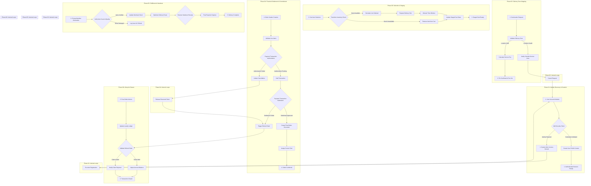

```mermaid
graph TD
    subgraph phase_01 [Phase 01: Identity Discovery & Curation]
        entrance_node_01["1. User Account Initiation"]
        auth_gate_01{"IAM Security Check"}
        profile_stage_01["Create User Profile Context"]
        exit_node_01["1. Authenticated Session Ready"]
        
        entrance_node_01 --> auth_gate_01
        auth_gate_01 -- "Credentials Validated" --> profile_stage_01
        auth_gate_01 -- "Identity Rejected" --> error_node_01["System Alert: Access Denied"]
        profile_stage_01 --> exit_node_01
    end

    subgraph phase_02 [Phase 02: Delivery Zone Mapping]
        entrance_node_02["2. Geolocation Request"]
        zone_check_02["Validate Delivery Zone"]
        fee_calc_02["Calculate Service Fee"]
        exit_node_02["2. Pin Confirmed & Fee Set"]
        
        entrance_node_02 --> zone_check_02
        zone_check_02 -- "Location Valid" --> fee_calc_02
        zone_check_02 -- "Location Invalid" --> error_node_02["Notify: Outside Service Area"]
        fee_calc_02 --> exit_node_02
    end

    subgraph phase_03 [Phase 03: Selection & Staging]
        entrance_node_03["3. Cart Item Selection"]
        stock_check_03{"Real-time Inventory Check"}
        price_calc_03["Calculate Line Subtotal"]
        slot_request_03["Request Delivery Slot"]
        slot_alloc_03["Allocate Time Window"]
        cart_stage_03["Update Staged Cart State"]
        exit_node_03["3. Staged Cart Ready"]
        
        entrance_node_03 --> stock_check_03
        stock_check_03 -- "Stock Available" --> price_calc_03
        stock_check_03 -- "Stock Unavailable" --> remove_node_03["Remove Item from Cart"]
        price_calc_03 --> slot_request_03
        slot_request_03 --> slot_alloc_03
        slot_alloc_03 --> cart_stage_03
        cart_stage_03 --> exit_node_03
    end

    subgraph phase_04 [Phase 04: Financial Settlement & Commitment]
        entrance_node_04["4. Order Header Creation"]
        line_items_04["Validate Line Items"]
        payment_auth_04{"Payment Transaction Authorization"}
        payment_settle_04{"Payment Transaction Settlement"}
        order_commit_04["Create Final Order Document"]
        courier_assign_04["Assign Courier Task"]
        exit_node_04["4. Order Confirmed"]
        
        entrance_node_04 --> line_items_04
        line_items_04 --> payment_auth_04
        payment_auth_04 -- "Authorization Pending" --> wait_state_04["Hold Transaction"]
        wait_state_04 --> payment_settle_04
        payment_auth_04 -- "Authorization Failed" --> cancel_order_04["Initiate Cancellation"]
        payment_settle_04 -- "Settlement Approved" --> order_commit_04
        payment_settle_04 -- "Settlement Failed" --> refund_path_04["Trigger Refund Claim"]
        order_commit_04 --> courier_assign_04
        courier_assign_04 --> exit_node_04
    end

    subgraph phase_05 [Phase 05: Fulfillment & Handover]
        entrance_node_05["5. Pickup Manifest Generation"]
        item_verify_05{"Verify Item Count & Quality"}
        stock_update_05["Update Merchant Stock"]
        courier_route_05["Optimize Delivery Route"]
        handover_receipt_05{"Receive Handover Receipt"}
        final_capture_05["Final Payment Capture"]
        exit_node_05["5. Delivery Complete"]
        
        entrance_node_05 --> item_verify_05
        item_verify_05 -- "Items Verified" --> stock_update_05
        item_verify_05 -- "Items Damaged" --> issue_note_05["Log Issue for Refund"]
        stock_update_05 --> courier_route_05
        courier_route_05 --> handover_receipt_05
        handover_receipt_05 --> final_capture_05
        final_capture_05 --> exit_node_05
    end

    subgraph phase_06 [Phase 06: Lifecycle Closure]
        entrance_node_06["6. Post-Order Actions"]
        loyalty_update_06["Update Loyalty Ledger"]
        refund_validate_06{"Validate Refund Claim"}
        balance_adjust_06["Adjust Account Balance"]
        exit_node_06["6. Transaction Closed"]
        
        entrance_node_06 --> loyalty_update_06
        loyalty_update_06 --> refund_validate_06
        refund_validate_06 -- "Claim Valid" --> balance_adjust_06
        refund_validate_06 -- "Claim Invalid" --> reject_claim_06["Notify Claim Rejected"]
        balance_adjust_06 --> exit_node_06
    end

    error_node_01["1. System Alert: Access Denied"] --> error_loop_01["Re-enter Registration"]
    error_loop_01 --> entrance_node_01
    
    error_node_02["Notify: Outside Service Area"] --> cancel_order_02["Cancel Request"]
    cancel_order_02 --> entrance_node_01
    
    remove_node_03["Remove Item from Cart"] --> cart_stage_03
    
    cancel_order_04["Initiate Cancellation"] --> release_stock_04["Release Reserved Stock"]
    release_stock_04 --> refund_path_04
    
    refund_path_04 --> refund_validate_06
    
    reject_claim_06["Notify Claim Rejected"] --> exit_node_06

    %% Internal Loop Connections for Closed-Loop Logic
    subgraph phase_01_internal [Phase 01: Internal Loops]
        error_loop_01["Re-enter Registration"]
        exit_node_01["1. Authenticated Session Ready"]
    end
    
    subgraph phase_02_internal [Phase 02: Internal Loops]
        cancel_order_02["Cancel Request"]
        exit_node_02["2. Pin Confirmed & Fee Set"]
    end

    subgraph phase_03_internal [Phase 03: Internal Loops]
        cart_stage_03["Update Staged Cart State"]
        remove_node_03["Remove Item from Cart"]
    end

    subgraph phase_04_internal [Phase 04: Internal Loops]
        refund_path_04["Trigger Refund Claim"]
        cancel_order_04["Initiate Cancellation"]
        release_stock_04["Release Reserved Stock"]
    end

    subgraph phase_05_internal [Phase 05: Internal Loops]
        issue_note_05["Log Issue for Refund"]
    end

    subgraph phase_06_internal [Phase 06: Internal Loops]
        reject_claim_06["Notify Claim Rejected"]
    end

```