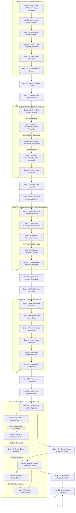

```mermaid
graph TD
    %% ============================================================================
    %% PHASE 1: INITIALIZATION & DISCOVERY
    %% ============================================================================
    subgraph phase_01 ["Phase 01: User Discovery & Curation"]
        entry_01["Step 1.1: IAM Officer Validates Identity Verification"]
        user_01["Step 1.2: User Account Profile Initialized"]
        geo_01["Step 1.3: Geolocation Request Verified"]
        zone_01["Step 1.4: Delivery Zone Mapping Confirmed"]
        fee_01["Step 1.5: Service Fee Calculated"]
        cart_01["Step 1.6: Cart Item Staging Created"]
    end

    entry_01 --> user_01
    user_01 --> geo_01
    geo_01 --> zone_01
    zone_01 --> fee_01
    fee_01 --> cart_01

    %% ============================================================================
    %% PHASE 2: LOGISTICS & SLOT ALLOCATION
    %% ============================================================================
    subgraph phase_02 ["Phase 02: Slot Allocation & Courier Assignment"]
        slot_01["Step 2.1: Delivery Slot Request Initiated"]
        dispatcher_01["Step 2.2: Logistics Dispatcher Validates Availability"]
        slot_02["Step 2.3: Time Window Enforcement Logic Applied"]
        route_01["Step 2.4: Route Optimization Algorithms Executed"]
        courier_01["Step 2.5: Courier Task Assigned"]
    end

    cart_01 --> slot_01
    slot_01 -- "On Slot Validation" --> dispatcher_01
    dispatcher_01 -- "On Availability Confirmed" --> slot_02
    slot_02 -- "On Slot Allocated" --> route_01
    route_01 --> courier_01

    %% ============================================================================
    %% PHASE 3: ORDER COMMITMENT & SETTLEMENT
    %% ============================================================================
    subgraph phase_03 ["Phase 03: Order Commitment & Financial Settlement"]
        order_01["Step 3.1: Order Header & Line Items Finalized"]
        inv_01["Step 3.2: Merchant Inventory Stock Reserved"]
        payment_01["Step 3.3: Payment Transaction Initiated"]
        auth_01["Step 3.4: Financial Settlement Verified"]
        invoice_01["Step 3.5: Digital Invoice Record Generated"]
    end

    courier_01 --> order_01
    order_01 --> inv_01
    inv_01 --> payment_01
    payment_01 -- "On Fund Transfer Status" --> auth_01
    auth_01 --> invoice_01

    %% ============================================================================
    %% PHASE 4: FULFILLMENT & HANDOVER
    %% ============================================================================
    subgraph phase_04 ["Phase 04: Fulfillment & Handover"]
        pickup_01["Step 4.1: Pickup Manifest Generated"]
        store_01["Step 4.2: Store Associate Scans SKUs"]
        stock_01["Step 4.3: Inventory Stock Deducted"]
        driver_01["Step 4.4: Courier Task Activated"]
        handover_01["Step 4.5: Handover Receipt Validated"]
        capture_01["Step 4.6: Final Payment Captured"]
    end

    invoice_01 --> pickup_01
    pickup_01 --> store_01
    store_01 --> stock_01
    stock_01 --> driver_01
    driver_01 --> handover_01
    handover_01 --> capture_01

    %% ============================================================================
    %% PHASE 5: POST-ORDER LIFECYCLE & EXCEPTION HANDLING
    %% ============================================================================
    subgraph phase_05 ["Phase 05: Post-Order Lifecycle & Settlement"]
        loyalty_01["Step 5.1: Loyalty Points Ledger Updated"]
        cancel_01["Step 5.2: Cancellation Request Received"]
        cancel_inv_01["Step 5.3: Inventory Release Executed"]
        cancel_fin_01["Step 5.4: Refund Claim Validated"]
        refund_01["Step 5.5: Balance Adjusted & Account Closed"]
        exception_01["Step 5.6: Exception Rollback Triggered"]
        rollback_01["Step 5.7: System Disruption Closure"]
    end

    capture_01 --> loyalty_01
    loyalty_01 --> cancel_01
    cancel_01 -- "On Pre-Handover Cancellation" --> cancel_inv_01
    cancel_inv_01 -- "On Stock Released" --> cancel_fin_01
    cancel_fin_01 -- "On Claim Validated" --> refund_01
    refund_01 --> exception_01
    exception_01 -- "On Mid-Flight Exception" --> rollback_01
    rollback_01 --> refund_01
    refund_01 --> phase_05

    %% ============================================================================
    %% INTER-PHASE HUB & SPOKE LINKS (STRICT ENFORCEMENT)
    %% ============================================================================
    exit_01["Step 1.6: Cart Item Staging Created"]
    enter_02["Step 2.1: Delivery Slot Request Initiated"]
    exit_02["Step 2.5: Courier Task Assigned"]
    enter_03["Step 3.1: Order Header & Line Items Finalized"]
    exit_03["Step 3.5: Digital Invoice Record Generated"]
    enter_04["Step 4.1: Pickup Manifest Generated"]
    exit_04["Step 4.6: Final Payment Captured"]
    enter_05["Step 5.1: Loyalty Points Ledger Updated"]
    exit_05["Step 5.5: Balance Adjusted & Account Closed"]

    %% HUB-AND-SPOKE CONNECTIONS
    cart_01 --> exit_01
    exit_01 --> enter_02
    enter_02 --> slot_01
    courier_01 --> exit_02
    exit_02 --> enter_03
    enter_03 --> order_01
    invoice_01 --> exit_03
    exit_03 --> enter_04
    enter_04 --> pickup_01
    capture_01 --> exit_04
    exit_04 --> enter_05
    enter_05 --> loyalty_01
    loyalty_01 --> exit_05
    exit_05 --> refund_01

    %% FINAL TERMINAL NODE
    refund_01 --> refund_final["Step 5.6: Transaction Lifecycle Complete"]
    refund_final --> phase_05_end["Step 5.7: System State Stabilized"]
    phase_05_end --> phase_05_end["Step 5.7: System State Stabilized"]

```