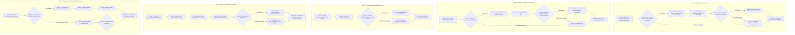

```mermaid
graph TD
    subgraph phase_01 [Phase 1: Identity & Service Discovery]
        entrance_node_01["Step 1.1: End-User Customer Initiates User Account Registration"]
        iam_check{"Step 1.2: IAM Security Officer Validates Identity Verification"}
        user_profile["Step 1.3: Create New User Account & Authenticated Session Token"]
        geo_request["Step 1.4: Submit Geolocation Request via Mobile GPS"]
        zone_validation{"Step 1.5: System Performs Service Area Validation"}
        geo_confirmed["Step 1.6: Output Confirmed Delivery Pin & Service Fee"]
        
        entrance_node_01 --> iam_check
        iam_check -- "On Success" --> user_profile
        iam_check -- "On Exception Trigger" --> rollback_node_01
        user_profile --> geo_request
        geo_request --> zone_validation
        zone_validation -- "On Success" --> geo_confirmed
        zone_validation -- "On Exception Trigger" --> rollback_node_01
        rollback_node_01["Step 1.X: Rollback to Registration or Cancel Request"]
        geo_confirmed --> exit_node_01
        
        exit_node_01["Step 1.End: Exit Phase 1 - User Context Established"]
        rollback_node_01 --> exit_node_01
    end
    
    subgraph phase_02 [Phase 2: Curation, Slotting & Cart Staging]
        entrance_node_02["Step 2.1: User Selects Products to Create Cart Item"]
        stock_check{"Step 2.2: Real-Time Inventory Availability Check"}
        price_calc["Step 2.3: Calculate Price & Update Cart State"]
        slot_request["Step 2.4: Request Delivery Slot"]
        dispatcher_check{"Step 2.5: Logistics Dispatcher Validates Courier Availability"}
        slot_assigned["Step 2.6: Output Assigned Pickup & Delivery Timestamps"]
        
        entrance_node_02 --> stock_check
        stock_check -- "On Success" --> price_calc
        stock_check -- "On Exception Trigger" --> rollback_node_02
        price_calc --> slot_request
        slot_request --> dispatcher_check
        dispatcher_check -- "On Success" --> slot_assigned
        dispatcher_check -- "On Exception Trigger" --> rollback_node_02
        rollback_node_02["Step 2.X: Rollback to Cart Modification or Cancellation"]
        slot_assigned --> exit_node_02
        
        exit_node_02["Step 2.End: Exit Phase 2 - Cart Staged with Slot"]
        rollback_node_02 --> exit_node_02
    end
    
    subgraph phase_03 [Phase 3: Transaction Execution & Settlement]
        entrance_node_03["Step 3.1: Finalize Transaction Submit Order Header"]
        line_items["Step 3.2: Submit Order Line Item Details"]
        payment_auth{"Step 3.3: Payment Transaction Process Fund Transfer"}
        invoice_gen["Step 3.4: Generate Digital Invoice Record"]
        
        entrance_node_03 --> line_items
        line_items --> payment_auth
        payment_auth -- "On Success" --> invoice_gen
        payment_auth -- "On Exception Trigger" --> rollback_node_03
        invoice_gen --> exit_node_03
        
        exit_node_03["Step 3.End: Exit Phase 3 - Financials Settled"]
        rollback_node_03["Step 3.X: Rollback Inventory & Cancel Order"]
        rollback_node_03 --> exit_node_03
    end
    
    subgraph phase_04 [Phase 4: Logistics Orchestration & Fulfillment]
        entrance_node_04["Step 4.1: Logistics Dispatcher Assigns Courier"]
        route_opt["Step 4.2: Execute Route Optimization Algorithm"]
        task_active["Step 4.3: Output Active Delivery Task & Courier ID"]
        pickup_manifest["Step 4.4: Store Associate Generates Pickup Manifest"]
        item_verify{"Step 4.5: Store Associate Verifies Items"}
        stock_update["Step 4.6: Merchant Inventory Manager Updates Stock Levels"]
        
        entrance_node_04 --> route_opt
        route_opt --> task_active
        task_active --> pickup_manifest
        pickup_manifest --> item_verify
        item_verify -- "On Success" --> stock_update
        item_verify -- "On Exception Trigger" --> rollback_node_04
        stock_update --> exit_node_04
        
        exit_node_04["Step 4.End: Exit Phase 4 - Inventory Reserved & Courier Assigned"]
        rollback_node_04["Step 4.X: Release Reserved Stock & Cancel Manifest"]
        rollback_node_04 --> exit_node_04
    end
    
    subgraph phase_05 [Phase 5: Handover, Audit & Post-Order Lifecycle]
        entrance_node_05["Step 5.1: Customer Provides Handover Receipt"]
        quality_check{"Step 5.2: Store Associate Confirms Quality Check"}
        final_capture["Step 5.3: Finance Agent Captures Final Payment"]
        status_update["Step 5.4: Output Delivered Status Update"]
        loyalty_points["Step 5.5: Update Loyalty Points Ledger"]
        refund_eval{"Step 5.6: Evaluate Refund Claim Input"}
        
        entrance_node_05 --> quality_check
        quality_check -- "On Success" --> final_capture
        quality_check -- "On Exception Trigger" --> rollback_node_05
        final_capture --> status_update
        status_update --> loyalty_points
        loyalty_points --> exit_node_05
        
        exit_node_05["Step 5.End: Exit Phase 5 - Transaction Complete"]
        rollback_node_05["Step 5.X: Initiate Refund Claim Process"]
        rollback_node_05 --> refund_eval
        refund_eval --> exit_node_05
    end

```