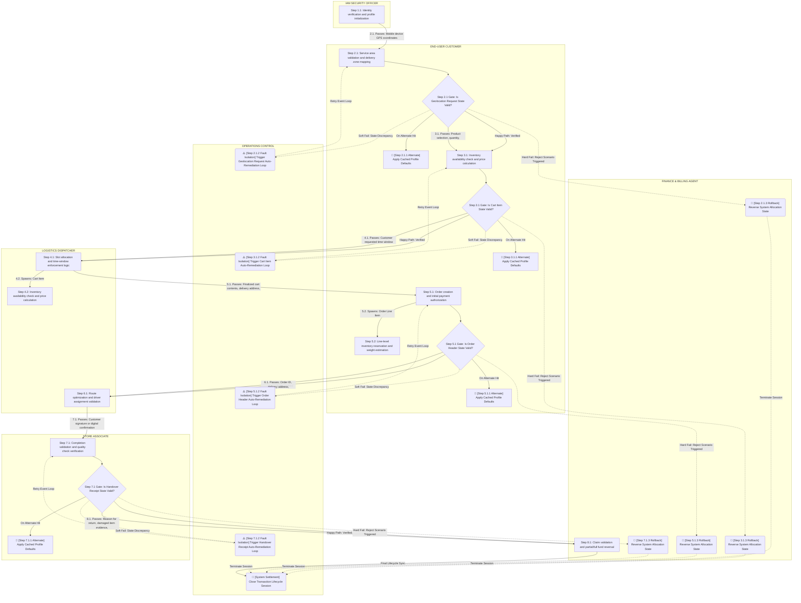

```mermaid
graph TD
    %% ============================================================================
    %% ENTERPRISE CROSS-FUNCTIONAL SWIMLANE AUTHORIZATION ARCHITECTURE MAP
    %% ============================================================================

    subgraph lane_0 ["IAM SECURITY OFFICER"]
        node_step_p1_1["Step 1.1: Identity verification and profile initialization"]
    end

    subgraph lane_1 ["END-USER CUSTOMER"]
        node_step_p2_1["Step 2.1: Service area validation and delivery zone mapping"]
        node_step_p2_1_gate{"Step 2.1 Gate: Is Geolocation Request State Valid?"}
        node_step_p2_1_alternate_path["🔄 [Step 2.1.1 Alternate] Apply Cached Profile Defaults"]
        node_step_p3_1["Step 3.1: Inventory availability check and price calculation"]
        node_step_p3_1_gate{"Step 3.1 Gate: Is Cart Item State Valid?"}
        node_step_p3_1_alternate_path["🔄 [Step 3.1.1 Alternate] Apply Cached Profile Defaults"]
        node_step_p5_1["Step 5.1: Order creation and initial payment authorization"]
        node_step_p5_2["Step 5.2: Line-level inventory reservation and weight estimation"]
        node_step_p5_1_gate{"Step 5.1 Gate: Is Order Header State Valid?"}
        node_step_p5_1_alternate_path["🔄 [Step 5.1.1 Alternate] Apply Cached Profile Defaults"]
    end

    subgraph lane_2 ["OPERATIONS CONTROL"]
        node_step_p2_1_degraded_alert("⚠️ [Step 2.1.2 Fault Isolation] Trigger Geolocation Request Auto-Remediation Loop")
        node_step_p3_1_degraded_alert("⚠️ [Step 3.1.2 Fault Isolation] Trigger Cart Item Auto-Remediation Loop")
        node_step_p5_1_degraded_alert("⚠️ [Step 5.1.2 Fault Isolation] Trigger Order Header Auto-Remediation Loop")
        node_step_p7_1_degraded_alert("⚠️ [Step 7.1.2 Fault Isolation] Trigger Handover Receipt Auto-Remediation Loop")
        system_closure_hub("🏁 [System Settlement] Close Transaction Lifecycle Session")
    end

    subgraph lane_3 ["FINANCE & BILLING AGENT"]
        node_step_p2_1_reject_scenario("🛑 [Step 2.1.3 Rollback] Reverse System Allocation State")
        node_step_p3_1_reject_scenario("🛑 [Step 3.1.3 Rollback] Reverse System Allocation State")
        node_step_p5_1_reject_scenario("🛑 [Step 5.1.3 Rollback] Reverse System Allocation State")
        node_step_p7_1_reject_scenario("🛑 [Step 7.1.3 Rollback] Reverse System Allocation State")
        node_step_p8_1["Step 8.1: Claim validation and partial/full fund reversal"]
    end

    subgraph lane_4 ["LOGISTICS DISPATCHER"]
        node_step_p4_1["Step 4.1: Slot allocation and time-window enforcement logic"]
        node_step_p4_2["Step 4.2: Inventory availability check and price calculation"]
        node_step_p6_1["Step 6.1: Route optimization and driver assignment validation"]
    end

    subgraph lane_5 ["STORE ASSOCIATE"]
        node_step_p7_1["Step 7.1: Completion validation and quality check verification"]
        node_step_p7_1_gate{"Step 7.1 Gate: Is Handover Receipt State Valid?"}
        node_step_p7_1_alternate_path["🔄 [Step 7.1.1 Alternate] Apply Cached Profile Defaults"]
    end

    %% --- FORCE INVISIBLE HORIZONTAL ALIGNMENT CONSTRAINTS (SIDE-BY-SIDE) ---
    lane_0 ~~~ lane_1
    lane_1 ~~~ lane_2
    lane_2 ~~~ lane_3
    lane_3 ~~~ lane_4
    lane_4 ~~~ lane_5

    %% --- ENTERPRISE INTER-SWIMLANE CROSS-BOUNDARY PIPELINE CHANNELS ---
    node_step_p1_1 -- " 2.1. Passes: Mobile device GPS coordinates " --> node_step_p2_1
    node_step_p2_1 --> node_step_p2_1_gate
    node_step_p2_1_gate -- " On Alternate Hit " --> node_step_p2_1_alternate_path
    node_step_p2_1_gate -. "Soft Fail: State Discrepancy" .-> node_step_p2_1_degraded_alert
    node_step_p2_1_degraded_alert -. "Retry Event Loop" .-> node_step_p2_1
    node_step_p2_1_gate -. "Hard Fail: Reject Scenario Triggered" .-> node_step_p2_1_reject_scenario
    node_step_p2_1_reject_scenario -. "Terminate Session" .-> system_closure_hub
    node_step_p2_1_gate -- " Happy Path: Verified " --> node_step_p3_1
    node_step_p2_1_gate -- " 3.1. Passes: Product selection, quantity, " --> node_step_p3_1
    node_step_p3_1 --> node_step_p3_1_gate
    node_step_p3_1_gate -- " On Alternate Hit " --> node_step_p3_1_alternate_path
    node_step_p3_1_gate -. "Soft Fail: State Discrepancy" .-> node_step_p3_1_degraded_alert
    node_step_p3_1_degraded_alert -. "Retry Event Loop" .-> node_step_p3_1
    node_step_p3_1_gate -. "Hard Fail: Reject Scenario Triggered" .-> node_step_p3_1_reject_scenario
    node_step_p3_1_reject_scenario -. "Terminate Session" .-> system_closure_hub
    node_step_p3_1_gate -- " Happy Path: Verified " --> node_step_p4_1
    node_step_p3_1_gate -- " 4.1. Passes: Customer requested time window " --> node_step_p4_1
    node_step_p4_1 -- " 4.2. Spawns: Cart Item " --> node_step_p4_2
    node_step_p4_1 -- " 5.1. Passes: Finalized cart contents, delivery address, " --> node_step_p5_1
    node_step_p5_1 -- " 5.2. Spawns: Order Line Item " --> node_step_p5_2
    node_step_p5_1 --> node_step_p5_1_gate
    node_step_p5_1_gate -- " On Alternate Hit " --> node_step_p5_1_alternate_path
    node_step_p5_1_gate -. "Soft Fail: State Discrepancy" .-> node_step_p5_1_degraded_alert
    node_step_p5_1_degraded_alert -. "Retry Event Loop" .-> node_step_p5_1
    node_step_p5_1_gate -. "Hard Fail: Reject Scenario Triggered" .-> node_step_p5_1_reject_scenario
    node_step_p5_1_reject_scenario -. "Terminate Session" .-> system_closure_hub
    node_step_p5_1_gate -- " Happy Path: Verified " --> node_step_p6_1
    node_step_p5_1_gate -- " 6.1. Passes: Order ID, delivery address, " --> node_step_p6_1
    node_step_p6_1 -- " 7.1. Passes: Customer signature or digital confirmation " --> node_step_p7_1
    node_step_p7_1 --> node_step_p7_1_gate
    node_step_p7_1_gate -- " On Alternate Hit " --> node_step_p7_1_alternate_path
    node_step_p7_1_gate -. "Soft Fail: State Discrepancy" .-> node_step_p7_1_degraded_alert
    node_step_p7_1_degraded_alert -. "Retry Event Loop" .-> node_step_p7_1
    node_step_p7_1_gate -. "Hard Fail: Reject Scenario Triggered" .-> node_step_p7_1_reject_scenario
    node_step_p7_1_reject_scenario -. "Terminate Session" .-> system_closure_hub
    node_step_p7_1_gate -- " Happy Path: Verified " --> node_step_p8_1
    node_step_p7_1_gate -- " 8.1. Passes: Reason for return, damaged item evidence, " --> node_step_p8_1
    node_step_p8_1 -- " Final Lifecycle Sync " --> system_closure_hub
```