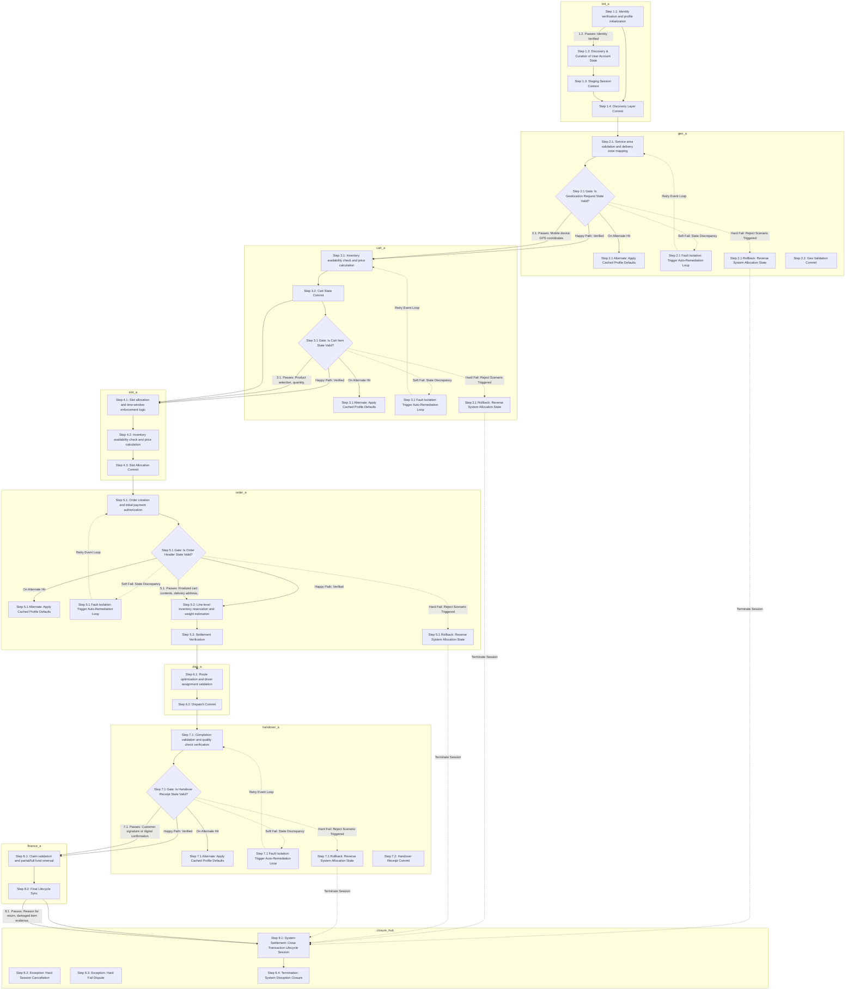

```mermaid
graph TD
    %% PHASE 1: INITIALIZATION & DISCOVERY
    subgraph init_a ["init_a"]
        init_entrance["Step 1.1: Identity verification and profile initialization"]
        discovery_1["Step 1.2: Discovery & Curation of User Account State"]
        discovery_2["Step 1.3: Staging Session Context"]
        init_exit["Step 1.4: Discovery Layer Commit"]
    end

    %% PHASE 2: GEOLOCATION & VALIDATION
    subgraph geo_a ["geo_a"]
        geo_entrance["Step 2.1: Service area validation and delivery zone mapping"]
        geo_decision{"Step 2.1 Gate: Is Geolocation Request State Valid?"}
        geo_alt["Step 2.1 Alternate: Apply Cached Profile Defaults"]
        geo_soft_fail["Step 2.1 Fault Isolation: Trigger Auto-Remediation Loop"]
        geo_hard_fail["Step 2.1 Rollback: Reverse System Allocation State"]
        geo_exit["Step 2.2: Geo Validation Commit"]
    end

    %% PHASE 3: INVENTORY & CART STAGING
    subgraph cart_a ["cart_a"]
        cart_entrance["Step 3.1: Inventory availability check and price calculation"]
        cart_decision{"Step 3.1 Gate: Is Cart Item State Valid?"}
        cart_alt["Step 3.1 Alternate: Apply Cached Profile Defaults"]
        cart_soft_fail["Step 3.1 Fault Isolation: Trigger Auto-Remediation Loop"]
        cart_hard_fail["Step 3.1 Rollback: Reverse System Allocation State"]
        cart_exit["Step 3.2: Cart State Commit"]
    end

    %% PHASE 4: SLOTTING & LOGISTICS
    subgraph slot_a ["slot_a"]
        slot_entrance["Step 4.1: Slot allocation and time-window enforcement logic"]
        slot_2["Step 4.2: Inventory availability check and price calculation"]
        slot_exit["Step 4.3: Slot Allocation Commit"]
    end

    %% PHASE 5: ORDER CREATION & SETTLEMENT
    subgraph order_a ["order_a"]
        order_entrance["Step 5.1: Order creation and initial payment authorization"]
        order_decision{"Step 5.1 Gate: Is Order Header State Valid?"}
        order_alt["Step 5.1 Alternate: Apply Cached Profile Defaults"]
        order_soft_fail["Step 5.1 Fault Isolation: Trigger Auto-Remediation Loop"]
        order_hard_fail["Step 5.1 Rollback: Reverse System Allocation State"]
        order_2["Step 5.2: Line-level inventory reservation and weight estimation"]
        order_exit["Step 5.3: Settlement Verification"]
    end

    %% PHASE 6: DISPATCH & ROUTING
    subgraph disp_a ["disp_a"]
        disp_entrance["Step 6.1: Route optimization and driver assignment validation"]
        disp_exit["Step 6.2: Dispatch Commit"]
    end

    %% PHASE 7: HANDOVER & FINAL VALIDATION
    subgraph handover_a ["handover_a"]
        handover_entrance["Step 7.1: Completion validation and quality check verification"]
        handover_decision{"Step 7.1 Gate: Is Handover Receipt State Valid?"}
        handover_alt["Step 7.1 Alternate: Apply Cached Profile Defaults"]
        handover_soft_fail["Step 7.1 Fault Isolation: Trigger Auto-Remediation Loop"]
        handover_hard_fail["Step 7.1 Rollback: Reverse System Allocation State"]
        handover_exit["Step 7.2: Handover Receipt Commit"]
    end

    %% PHASE 8: FINANCE & CLOSURE
    subgraph finance_a ["finance_a"]
        finance_entrance["Step 8.1: Claim validation and partial/full fund reversal"]
        finance_exit["Step 8.2: Final Lifecycle Sync"]
    end

    %% PHASE 9: GLOBAL CLOSURE & EXCEPTIONS
    subgraph closure_hub ["closure_hub"]
        closure_entrance["Step 9.1: System Settlement: Close Transaction Lifecycle Session"]
        closure_2["Step 9.2: Exception: Hard Session Cancellation"]
        closure_3["Step 9.3: Exception: Hard Fail Dispute"]
        closure_exit["Step 9.4: Termination: System Disruption Closure"]
    end

    %% --- LINKS: PHASE 1 ---
    init_entrance --> init_exit
    init_entrance -- " 1.2. Passes: Identity Verified " --> discovery_1
    discovery_1 --> discovery_2
    discovery_2 --> init_exit

    %% --- LINKS: PHASE 2 ---
    init_exit --> geo_entrance
    geo_entrance --> geo_decision
    geo_decision -- " On Alternate Hit " --> geo_alt
    geo_decision -. "Soft Fail: State Discrepancy" .-> geo_soft_fail
    geo_soft_fail -. "Retry Event Loop" .-> geo_entrance
    geo_decision -. "Hard Fail: Reject Scenario Triggered" .-> geo_hard_fail
    geo_hard_fail -. "Terminate Session" .-> closure_entrance
    geo_decision -- " Happy Path: Verified " --> cart_entrance
    geo_decision -- " 2.1. Passes: Mobile device GPS coordinates " --> cart_entrance
    cart_entrance --> cart_exit
    cart_exit --> cart_decision
    cart_decision -- " On Alternate Hit " --> cart_alt
    cart_decision -. "Soft Fail: State Discrepancy" .-> cart_soft_fail
    cart_soft_fail -. "Retry Event Loop" .-> cart_entrance
    cart_decision -. "Hard Fail: Reject Scenario Triggered" .-> cart_hard_fail
    cart_hard_fail -. "Terminate Session" .-> closure_entrance
    cart_decision -- " Happy Path: Verified " --> slot_entrance
    cart_decision -- " 3.1. Passes: Product selection, quantity, " --> slot_entrance

    %% --- LINKS: PHASE 3 ---
    cart_exit --> slot_entrance
    slot_entrance --> slot_2
    slot_2 --> slot_exit
    slot_exit --> order_entrance
    order_entrance --> order_decision
    order_decision -- " On Alternate Hit " --> order_alt
    order_decision -. "Soft Fail: State Discrepancy" .-> order_soft_fail
    order_soft_fail -. "Retry Event Loop" .-> order_entrance
    order_decision -. "Hard Fail: Reject Scenario Triggered" .-> order_hard_fail
    order_hard_fail -. "Terminate Session" .-> closure_entrance
    order_decision -- " Happy Path: Verified " --> order_2
    order_decision -- " 5.1. Passes: Finalized cart contents, delivery address, " --> order_2
    order_2 --> order_exit
    order_exit --> disp_entrance
    disp_entrance --> disp_exit
    disp_exit --> handover_entrance
    handover_entrance --> handover_decision
    handover_decision -- " On Alternate Hit " --> handover_alt
    handover_decision -. "Soft Fail: State Discrepancy" .-> handover_soft_fail
    handover_soft_fail -. "Retry Event Loop" .-> handover_entrance
    handover_decision -. "Hard Fail: Reject Scenario Triggered" .-> handover_hard_fail
    handover_hard_fail -. "Terminate Session" .-> closure_entrance
    handover_decision -- " Happy Path: Verified " --> finance_entrance
    handover_decision -- " 7.1. Passes: Customer signature or digital confirmation " --> finance_entrance
    finance_entrance --> finance_exit
    finance_exit --> closure_entrance
    finance_exit -- " 8.1. Passes: Reason for return, damaged item evidence, " --> closure_entrance
    closure_entrance --> closure_exit
```