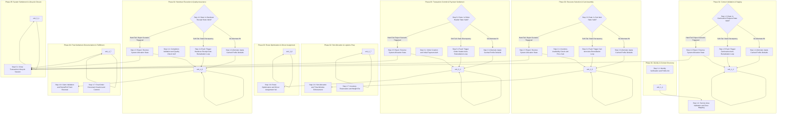

```mermaid
graph TD
    subgraph phase_01_a["Phase 01: Identity & Context Discovery"]
        entry_1_1["Step 1.1: Identity Verification and Profile Init"]
        exit_1_1
    end
    subgraph phase_01_b["Phase 01: Context Validation & Staging"]
        entry_1_2["Step 1.2: Service Area Validation and Zone Mapping"]
        decision_1_3{"Step 1.3 Gate: Is Geolocation Request State Valid?"}
        alt_1_4["Step 1.4 Alternate: Apply Cached Profile Defaults"]
        fail_soft_1_5["Step 1.5 Fault: Trigger Geolocation Auto-Remediation Loop"]
        fail_hard_1_6["Step 1.6 Reject: Reverse System Allocation State"]
        exit_1_2
    end
    phase_01_a --> exit_1_1
    exit_1_1 --> entry_1_2
    decision_1_3 -- "On Alternate Hit" --> alt_1_4
    decision_1_3 -- "Soft Fail: State Discrepancy" --> fail_soft_1_5
    decision_1_3 -- "Hard Fail: Reject Scenario Triggered" --> fail_hard_1_6
    alt_1_4 --> exit_1_2
    fail_soft_1_5 --> exit_1_2
    fail_hard_1_6 --> exit_1_2
    exit_1_2 --> exit_1_2

    subgraph phase_02_a["Phase 02: Resource Selection & Cart Assembly"]
        entry_2_1["Step 2.1: Inventory Availability Check and Price Calc"]
        decision_2_2{"Step 2.2 Gate: Is Cart Item State Valid?"}
        alt_2_3["Step 2.3 Alternate: Apply Cached Profile Defaults"]
        fail_soft_2_4["Step 2.4 Fault: Trigger Cart Item Auto-Remediation Loop"]
        fail_hard_2_5["Step 2.5 Reject: Reverse System Allocation State"]
        exit_2_2
    end
    subgraph phase_02_b["Phase 02: Slot Allocation & Logistics Prep"]
        entry_2_6["Step 2.6: Slot Allocation and Time-Window Enforcement"]
        entry_2_7["Step 2.7: Inventory Reservation and Weight Est"]
        exit_2_7
    end
    exit_2_2 --> entry_2_6
    exit_2_7 --> exit_2_7

    phase_02_a --> exit_2_2
    decision_2_2 -- "On Alternate Hit" --> alt_2_3
    decision_2_2 -- "Soft Fail: State Discrepancy" --> fail_soft_2_4
    decision_2_2 -- "Hard Fail: Reject Scenario Triggered" --> fail_hard_2_5
    alt_2_3 --> exit_2_2
    fail_soft_2_4 --> exit_2_2
    fail_hard_2_5 --> exit_2_2
    exit_2_2 --> exit_2_2

    subgraph phase_03_a["Phase 03: Transaction Commit & Payment Settlement"]
        entry_3_1["Step 3.1: Order Creation and Initial Payment Auth"]
        decision_3_2{"Step 3.2 Gate: Is Order Header State Valid?"}
        alt_3_3["Step 3.3 Alternate: Apply Cached Profile Defaults"]
        fail_soft_3_4["Step 3.4 Fault: Trigger Order Header Auto-Remediation Loop"]
        fail_hard_3_5["Step 3.5 Reject: Reverse System Allocation State"]
        exit_3_2
    end
    subgraph phase_03_b["Phase 03: Route Optimization & Driver Assignment"]
        entry_3_6["Step 3.6: Route Optimization and Driver Assignment Val"]
        exit_3_6
    end
    exit_3_2 --> entry_3_6
    exit_3_6 --> exit_3_6

    phase_03_a --> exit_3_2
    decision_3_2 -- "On Alternate Hit" --> alt_3_3
    decision_3_2 -- "Soft Fail: State Discrepancy" --> fail_soft_3_4
    decision_3_2 -- "Hard Fail: Reject Scenario Triggered" --> fail_hard_3_5
    alt_3_3 --> exit_3_2
    fail_soft_3_4 --> exit_3_2
    fail_hard_3_5 --> exit_3_2
    exit_3_2 --> exit_3_2

    subgraph phase_04_a["Phase 04: Handover Execution & Quality Assurance"]
        entry_4_1["Step 4.1: Completion Validation and Quality Check Verif"]
        decision_4_2{"Step 4.2 Gate: Is Handover Receipt State Valid?"}
        alt_4_3["Step 4.3 Alternate: Apply Cached Profile Defaults"]
        fail_soft_4_4["Step 4.4 Fault: Trigger Handover Receipt Auto-Remediation Loop"]
        fail_hard_4_5["Step 4.5 Reject: Reverse System Allocation State"]
        exit_4_2
    end
    subgraph phase_04_b["Phase 04: Post-Settlement Documentation & Fulfillment"]
        entry_4_6["Step 4.6: Claim Validation and Partial/Full Fund Reversal"]
        entry_4_7["Step 4.7: Final Order Document Creation and Commit"]
        exit_4_7
    end
    exit_4_2 --> entry_4_6
    exit_4_7 --> exit_4_7

    phase_04_a --> exit_4_2
    decision_4_2 -- "On Alternate Hit" --> alt_4_3
    decision_4_2 -- "Soft Fail: State Discrepancy" --> fail_soft_4_4
    decision_4_2 -- "Hard Fail: Reject Scenario Triggered" --> fail_hard_4_5
    alt_4_3 --> exit_4_2
    fail_soft_4_4 --> exit_4_2
    fail_hard_4_5 --> exit_4_2
    exit_4_2 --> exit_4_2

    subgraph phase_05_closure["Phase 05: System Settlement & Lifecycle Closure"]
        entry_5_1["Step 5.1: Close Transaction Lifecycle Session"]
        exit_5_1
    end
    exit_4_7 --> entry_5_1
    fail_hard_1_6 --> entry_5_1
    fail_hard_2_5 --> entry_5_1
    fail_hard_3_5 --> entry_5_1
    fail_hard_4_5 --> entry_5_1
    exit_5_1 --> exit_5_1
```