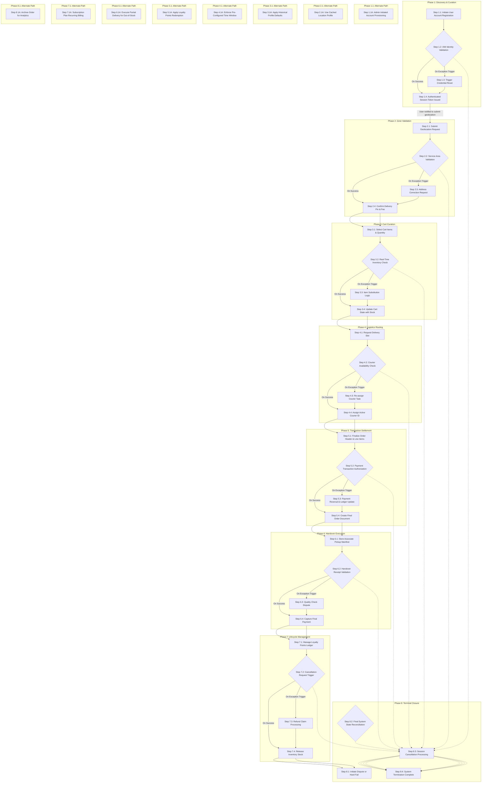

```mermaid
graph TD
    %% =============================================================================
    %% PHASE 1: INITIAL DISCOVERY & CURATION LAYER (IDENTITY & ACCESS)
    %% =============================================================================
    subgraph phase_01_a["Phase 1: Discovery & Curation"]
        entrance_01["Step 1.1: Initiate User Account Registration"]
        decision_01{"Step 1.2: IAM Identity Validation"}
        recovery_01["Step 1.3: Trigger Credential Reset"]
        exit_01["Step 1.4: Authenticated Session Token Issued"]
    end

    subgraph phase_01_b["Phase 1.1: Alternate Path"]
        alt_01["Step 1.1A: Admin Initiated Account Provisioning"]
    end

    %% PHASE 1 FLOW
    entrance_01 --> decision_01
    decision_01 -- "On Success" --> exit_01
    decision_01 -- "On Exception Trigger" --> recovery_01
    recovery_01 --> exit_01


    %% =============================================================================
    %% PHASE 2: GEOLOCATION & ZONE VALIDATION LAYER
    %% =============================================================================
    subgraph phase_02_a["Phase 2: Zone Validation"]
        entrance_02["Step 2.1: Submit Geolocation Request"]
        decision_02{"Step 2.2: Service Area Validation"}
        recovery_02["Step 2.3: Address Correction Request"]
        exit_02["Step 2.4: Confirm Delivery Pin & Fee"]
    end

    subgraph phase_02_b["Phase 2.1: Alternate Path"]
        alt_02["Step 2.1A: Use Cached Location Profile"]
    end

    %% PHASE 2 FLOW
    entrance_02 --> decision_02
    decision_02 -- "On Success" --> exit_02
    decision_02 -- "On Exception Trigger" --> recovery_02
    recovery_02 --> exit_02

    exit_02 --> entrance_03

    %% =============================================================================
    %% PHASE 3: CART CURATION & INVENTORY STAGING LAYER
    %% =============================================================================
    subgraph phase_03_a["Phase 3: Cart Curation"]
        entrance_03["Step 3.1: Select Cart Items & Quantity"]
        decision_03{"Step 3.2: Real-Time Inventory Check"}
        recovery_03["Step 3.3: Item Substitution Logic"]
        exit_03["Step 3.4: Update Cart State with Stock"]
    end

    subgraph phase_03_b["Phase 3.1: Alternate Path"]
        alt_03["Step 3.1A: Apply Historical Profile Defaults"]
    end

    %% PHASE 3 FLOW
    entrance_03 --> decision_03
    decision_03 -- "On Success" --> exit_03
    decision_03 -- "On Exception Trigger" --> recovery_03
    recovery_03 --> exit_03

    exit_03 --> entrance_04

    %% =============================================================================
    %% PHASE 4: SLOT ALLOCATION & LOGISTICS ROUTING LAYER
    %% =============================================================================
    subgraph phase_04_a["Phase 4: Logistics Routing"]
        entrance_04["Step 4.1: Request Delivery Slot"]
        decision_04{"Step 4.2: Courier Availability Check"}
        recovery_04["Step 4.3: Re-assign Courier Task"]
        exit_04["Step 4.4: Assign Active Courier ID"]
    end

    subgraph phase_04_b["Phase 4.1: Alternate Path"]
        alt_04["Step 4.1A: Enforce Pre-Configured Time Window"]
    end

    %% PHASE 4 FLOW
    entrance_04 --> decision_04
    decision_04 -- "On Success" --> exit_04
    decision_04 -- "On Exception Trigger" --> recovery_04
    recovery_04 --> exit_04

    exit_04 --> entrance_05

    %% =============================================================================
    %% PHASE 5: TRANSACTION COMMIT & SETTLEMENT SYNCHRONIZATION LAYER
    %% =============================================================================
    subgraph phase_05_a["Phase 5: Transaction Settlement"]
        entrance_05["Step 5.1: Finalize Order Header & Line Items"]
        decision_05{"Step 5.2: Payment Transaction Authorization"}
        recovery_05["Step 5.3: Payment Reversal & Ledger Update"]
        exit_05["Step 5.4: Create Final Order Document"]
    end

    subgraph phase_05_b["Phase 5.1: Alternate Path"]
        alt_05["Step 5.1A: Apply Loyalty Points Redemption"]
    end

    %% PHASE 5 FLOW
    entrance_05 --> decision_05
    decision_05 -- "On Success" --> exit_05
    decision_05 -- "On Exception Trigger" --> recovery_05
    recovery_05 --> exit_05

    exit_05 --> entrance_06

    %% =============================================================================
    %% PHASE 6: HANDOVER & CLOSURE LAYER
    %% =============================================================================
    subgraph phase_06_a["Phase 6: Handover Execution"]
        entrance_06["Step 6.1: Store Associate Pickup Manifest"]
        decision_06{"Step 6.2: Handover Receipt Validation"}
        recovery_06["Step 6.3: Quality Check Dispute"]
        exit_06["Step 6.4: Capture Final Payment"]
    end

    subgraph phase_06_b["Phase 6.1: Alternate Path"]
        alt_06["Step 6.1A: Execute Partial Delivery for Out-of-Stock"]
    end

    %% PHASE 6 FLOW
    entrance_06 --> decision_06
    decision_06 -- "On Success" --> exit_06
    decision_06 -- "On Exception Trigger" --> recovery_06
    recovery_06 --> exit_06

    exit_06 --> entrance_07

    %% =============================================================================
    %% PHASE 7: POST-SETTLEMENT EXCEPTIONS & LIFECYCLE MANAGEMENT LAYER
    %% =============================================================================
    subgraph phase_07_a["Phase 7: Lifecycle Management"]
        entrance_07["Step 7.1: Manage Loyalty Points Ledger"]
        decision_07{"Step 7.2: Cancellation Request Trigger"}
        recovery_07["Step 7.3: Refund Claim Processing"]
        exit_07["Step 7.4: Release Inventory Stock"]
    end

    subgraph phase_07_b["Phase 7.1: Alternate Path"]
        alt_07["Step 7.1A: Subscription Plan Recurring Billing"]
    end

    %% PHASE 7 FLOW
    entrance_07 --> decision_07
    decision_07 -- "On Success" --> exit_07
    decision_07 -- "On Exception Trigger" --> recovery_07
    recovery_07 --> exit_07

    exit_07 --> entrance_08

    %% =============================================================================
    %% PHASE 8: GLOBAL TERMINAL CLOSURE & DISPUTE RESOLUTION LAYER
    %% =============================================================================
    subgraph phase_08_a["Phase 8: Terminal Closure"]
        entrance_08["Step 8.1: Initiate Dispute or Hard Fail"]
        decision_08{"Step 8.2: Final System State Reconciliation"}
        recovery_08["Step 8.3: Session Cancellation Processing"]
        exit_08["Step 8.4: System Termination Complete"]
    end

    subgraph phase_08_b["Phase 8.1: Alternate Path"]
        alt_08["Step 8.1A: Archive Order for Analytics"]
    end

    %% =============================================================================
    %% CROSS-BOUNDARY EXCEPTION WIRING (DASHED LINKS)
    %% =============================================================================
    %% Phase 1 Exceptions
    decision_01 -.-> recovery_08
    recovery_08 -.-> exit_08

    %% Phase 2 Exceptions
    decision_02 -.-> recovery_08
    recovery_08 -.-> exit_08

    %% Phase 3 Exceptions
    decision_03 -.-> recovery_08
    recovery_08 -.-> exit_08

    %% Phase 4 Exceptions
    decision_04 -.-> recovery_08
    recovery_08 -.-> exit_08

    %% Phase 5 Exceptions
    decision_05 -.-> recovery_08
    recovery_08 -.-> exit_08

    %% Phase 6 Exceptions
    decision_06 -.-> recovery_08
    recovery_08 -.-> exit_08

    %% Phase 7 Exceptions
    decision_07 -.-> recovery_08
    recovery_08 -.-> exit_08

    %% Phase 8 Exceptions
    decision_08 -.-> recovery_08
    recovery_08 -.-> exit_08

    %% =============================================================================
    %% INTER-SUBGRAPH CONNECTIONS (EXIT TO ENTRANCE)
    %% =============================================================================
    exit_02 --> entrance_03
    exit_03 --> entrance_04
    exit_04 --> entrance_05
    exit_05 --> entrance_06
    exit_06 --> entrance_07
    exit_07 --> entrance_08
    exit_01 -- "User notified to submit geolocation" --> entrance_02
```