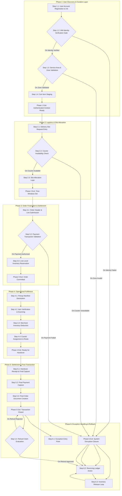

```mermaid
graph TD
    subgraph phase_01 ["Phase 1: User Discovery & Curation Layer"]
        entry_point_1["Step 1.1: User Account Registration & Init"]
        gate_auth_1{"Step 1.2: IAM Identity Verification Gate"}
        gate_geo_1{"Step 1.3: Service Area & Zone Validation"}
        cart_staging_1["Step 1.4: Cart Item Staging"]
        exit_phase_1["Phase 1 Exit: Authenticated Context Ready"]
    end

    subgraph phase_02 ["Phase 2: Logistics & Slot Allocation"]
        entry_point_2["Step 2.1: Delivery Slot Request Entry"]
        dispatcher_check_1{"Step 2.2: Courier Availability Check"}
        slot_assignment_1["Step 2.3: Slot Allocation Logic"]
        exit_phase_2["Phase 2 Exit: Time Windows Set"]
    end

    subgraph phase_03 ["Phase 3: Order Finalization & Settlement"]
        entry_point_3["Step 3.1: Order Header & Line Submission"]
        payment_auth_1{"Step 3.2: Payment Transaction Validation"}
        stock_res_1["Step 3.3: Line-Level Inventory Reservation"]
        exit_phase_3["Phase 3 Exit: Order Committed"]
    end

    subgraph phase_04 ["Phase 4: Operational Fulfillment"]
        entry_point_4["Step 4.1: Pickup Manifest Generation"]
        store_scan_1["Step 4.2: Item Verification & Scanning"]
        stock_ded_1["Step 4.3: Merchant Inventory Deduction"]
        courier_assign_1["Step 4.4: Courier Assignment & Route"]
        exit_phase_4["Phase 4 Exit: Ready for Handover"]
    end

    subgraph phase_05 ["Phase 5: Settlement & Post-Transaction"]
        entry_point_5["Step 5.1: Handover Receipt & Final Capture"]
        final_settle_1["Step 5.2: Final Payment Capture"]
        doc_final_1["Step 5.3: Final Order Document Creation"]
        loop_refund_1{"Step 5.4: Refund Claim Evaluation"}
        exit_phase_5["Phase 5 Exit: Transaction Closed"]
    end

    subgraph phase_06 ["Phase 6: Exception Handling & Rollback"]
        entry_point_6["Step 6.1: Exception Entry Point"]
        rollback_inv_1["Step 6.2: Reversing Ledger Action"]
        loop_cancel_1["Step 6.3: Inventory Release Loop"]
        exit_phase_6["Phase 6 Exit: System Disruption Closure"]
    end

    entry_point_1 --> gate_auth_1
    gate_auth_1 -- "On Identity Verified" --> gate_geo_1
    gate_auth_1 -- "On Identity Failed" --> exit_phase_6
    exit_phase_6 --> loop_cancel_1
    loop_cancel_1 --> rollback_inv_1
    rollback_inv_1 --> loop_cancel_1
    gate_geo_1 -- "On Zone Validated" --> cart_staging_1
    gate_geo_1 -- "On Zone Invalid" --> exit_phase_6
    exit_phase_6 --> rollback_inv_1
    cart_staging_1 --> exit_phase_1
    exit_phase_1 --> entry_point_2
    entry_point_2 --> dispatcher_check_1
    dispatcher_check_1 -- "On Courier Available" --> slot_assignment_1
    dispatcher_check_1 -- "On Courier Unavailable" --> exit_phase_6
    exit_phase_6 --> rollback_inv_1
    slot_assignment_1 --> exit_phase_2
    exit_phase_2 --> entry_point_3
    entry_point_3 --> payment_auth_1
    payment_auth_1 -- "On Payment Authorized" --> stock_res_1
    payment_auth_1 -- "On Payment Failed" --> exit_phase_6
    exit_phase_6 --> rollback_inv_1
    stock_res_1 --> exit_phase_3
    exit_phase_3 --> entry_point_4
    entry_point_4 --> store_scan_1
    store_scan_1 --> stock_ded_1
    stock_ded_1 --> courier_assign_1
    courier_assign_1 --> exit_phase_4
    exit_phase_4 --> entry_point_5
    entry_point_5 --> final_settle_1
    final_settle_1 --> doc_final_1
    doc_final_1 --> exit_phase_5
    exit_phase_5 --> entry_point_6
    exit_phase_5 --> loop_refund_1
    loop_refund_1 -- "On Refund Approved" --> rollback_inv_1
    loop_refund_1 -- "On Refund Rejected" --> exit_phase_5
```