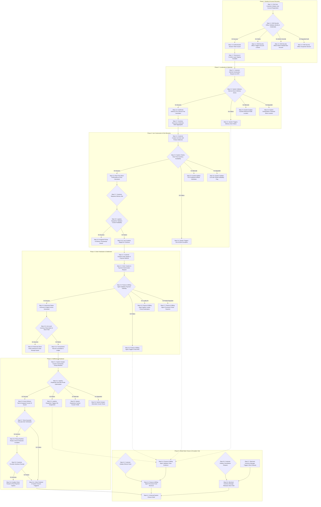

```mermaid
graph TD
    subgraph phase_01 [Phase 1: Identity & Access Discovery]
        EntranceNode01["Step 1.1: End-User Customer Initiates User Account Registration"]
        IAMVerify{"Step 1.2: IAM Security Officer Validates Identity & Credentials"}
        SuccessPath01["Step 1.3: Authenticated Session Token Issued"]
        ErrorPath01["Step 1.4: IAM Security Officer Triggers Account Lockout"]
        AltPath01["Step 1.5: IAM Security Officer Admin-Initiated New Account"]
        DegradedPath01["Step 1.6: IAM Security Officer Suspends Session"]
        ExitNode01["Step 1.7: Discovery & Curation Layer Staging Complete"]
    end

    subgraph phase_02 [Phase 2: Localization & Selection]
        EntranceNode02["Step 2.1: Customer Submits Geolocation Request via GPS"]
        ZoneCheck{"Step 2.2: System Validates Service Area & Delivery Zones"}
        SuccessPath02["Step 2.3: Confirmed Delivery Pin & Service Fee Calculated"]
        ErrorPath02["Step 2.4: System Triggers Delivery Zone Failure"]
        AltPath02["Step 2.5: System Assigns Cached Historical Profile Location"]
        DegradedPath02["Step 2.6: System Downgrades to Nearest Store Location"]
        ExitNode02["Step 2.7: Inventory Discovery & Selection State Aggregated"]
    end

    subgraph phase_03 [Phase 3: Cart Construction & Slot Allocation]
        EntranceNode03["Step 3.1: Customer Creates Cart Item with Product Selection"]
        StockCheck{"Step 3.2: System Checks Real-Time Inventory Availability"}
        SuccessPath03["Step 3.3: Real-Time Stock Confirmation & Price Calculated"]
        ErrorPath03["Step 3.4: System Triggers Out-of-Stock Exception"]
        AltPath03["Step 3.5: System Applies Pre-Configured Default Substitute"]
        DegradedPath03["Step 3.6: System Updates Cart with Partial Availability Flag"]
        SlotReq{"Step 3.7: Customer Requests Delivery Slot"}
        DispatcherCheck{"Step 3.8: Logistics Dispatcher Validates Courier Availability"}
        SuccessPath03B["Step 3.9: Assigned Pickup & Delivery Timestamps Issued"]
        ExitNode03["Step 3.10: Cart Contents Staged for Checkout"]
    end

    subgraph phase_04 [Phase 4: Order Finalization & Settlement]
        EntranceNode04["Step 4.1: Customer Submits Order Header & Payment Method"]
        CreateOrder["Step 4.2: Order Creation & Payment Authorization Request"]
        AuthCheck{"Step 4.3: Finance & Billing Agent Validates Payment Gateway"}
        SuccessPath04["Step 4.4: Authorized Status Achieved & Digital Invoice Generated"]
        ErrorPath04["Step 4.5: Finance & Billing Agent Triggers Fraud Alert"]
        AltPath04["Step 4.6: Finance & Billing Agent Applies Loyalty Points Redemption"]
        DegradedPath04["Step 4.7: Finance & Billing Agent Processes Partial Payment"]
        CreateOrder2{"Step 4.8: Line-Level Inventory Reservation & Stock Hold"}
        SuccessPath04B["Step 4.9: Reserved Stock Hold Confirmed & Order Receipt Issued"]
        ExitNode04["Step 4.10: Transactional Record Committed to Ledger"]
    end

    subgraph phase_05 [Phase 5: Fulfillment & Handover]
        EntranceNode05["Step 5.1: System Assigns Courier & Generates Pickup Manifest"]
        RouteOpt{"Step 5.2: Logistics Dispatcher Executes Route Optimization"}
        SuccessPath05["Step 5.3: Active Delivery Task & Assigned Courier ID Issued"]
        ErrorPath05["Step 5.4: Logistics Dispatcher Triggers Re-Assignment"]
        AltPath05["Step 5.5: System Dispatches Cached Courier Profile"]
        DegradedPath05["Step 5.6: System Assigns Alternative Courier Route"]
        PickupAct{"Step 5.7: Store Associate Executes Item Verification"}
        SuccessPath05B["Step 5.8: Pickup Manifest Ready & Stock Deduction Complete"]
        HandoverAct{"Step 5.9: Customer Provides Handover Receipt"}
        SuccessPath05C["Step 5.10: Quality Check Passed & Final Payment Capture"]
        ExitNode05["Step 5.11: Order Finalized & System Closure Triggered"]
    end

    subgraph phase_06 [Phase 6: Global State Closure & Exception Hub]
        ClosureNode["Step 6.1: Universal System Closure Node"]
        RefundAct{"Step 6.2: Customer Initiates Refund Claim"}
        SuccessPath06["Step 6.3: Finance & Billing Agent Processes Fund Reversal"]
        ErrorPath06["Step 6.4: Finance & Billing Agent Validates Claim Evidence"]
        CancelAct{"Step 6.5: Customer Initiates Cancellation Request"}
        SuccessPath06B["Step 6.6: Merchant Inventory Manager Releases Stock Hold"]
        ErrorPath06B["Step 6.7: Merchant Inventory Manager Triggers Stock Release"]
    end

    EntranceNode01 --> IAMVerify
    IAMVerify -- "On Success" --> SuccessPath01
    IAMVerify -- "On Failure" --> ErrorPath01
    IAMVerify -- "On Admin Override" --> AltPath01
    IAMVerify -- "On Degraded Auth" --> DegradedPath01
    SuccessPath01 --> ExitNode01

    EntranceNode02 --> ZoneCheck
    ZoneCheck -- "On Success" --> SuccessPath02
    ZoneCheck -- "On Failure" --> ErrorPath02
    ZoneCheck -- "On Alternate" --> AltPath02
    ZoneCheck -- "On Degraded" --> DegradedPath02
    SuccessPath02 --> ExitNode02

    EntranceNode03 --> StockCheck
    StockCheck -- "On Success" --> SuccessPath03
    StockCheck -- "On Failure" --> ErrorPath03
    StockCheck -- "On Alternate" --> AltPath03
    StockCheck -- "On Degraded" --> DegradedPath03
    SuccessPath03 --> SlotReq
    SlotReq --> DispatcherCheck
    DispatcherCheck -- "On Success" --> SuccessPath03B
    DispatcherCheck -- "On Failure" --> ExitNode03

    EntranceNode04 --> CreateOrder
    CreateOrder --> AuthCheck
    AuthCheck -- "On Success" --> SuccessPath04
    AuthCheck -- "On Failure" --> ErrorPath04
    AuthCheck -- "On Loyalty Alt" --> AltPath04
    AuthCheck -- "On Partial Degraded" --> DegradedPath04
    SuccessPath04 --> CreateOrder2
    CreateOrder2 -- "On Success" --> SuccessPath04B
    CreateOrder2 -- "On Failure" --> ExitNode04

    EntranceNode05 --> RouteOpt
    RouteOpt -- "On Success" --> SuccessPath05
    RouteOpt -- "On Failure" --> ErrorPath05
    RouteOpt -- "On Alternate" --> AltPath05
    RouteOpt -- "On Degraded" --> DegradedPath05
    SuccessPath05 --> PickupAct
    PickupAct -- "On Success" --> SuccessPath05B
    PickupAct -- "On Failure" --> ExitNode05
    SuccessPath05B --> HandoverAct
    HandoverAct -- "On Success" --> SuccessPath05C
    HandoverAct -- "On Failure" --> ExitNode05

    ExitNode01 --> EntranceNode02
    ExitNode02 --> EntranceNode03
    ExitNode03 --> EntranceNode04
    ExitNode04 --> EntranceNode05
    ExitNode05 --> ClosureNode

    ErrorPath02 -.-> ErrorPath06
    ErrorPath03 -.-> ErrorPath06
    ErrorPath04 -.-> ErrorPath06
    ErrorPath05 -.-> ErrorPath06

    RefundAct --> SuccessPath06
    ErrorPath06 --> SuccessPath06
    SuccessPath06 --> ClosureNode

    CancelAct --> SuccessPath06B
    ErrorPath06B --> SuccessPath06B
    SuccessPath06B --> ClosureNode
```