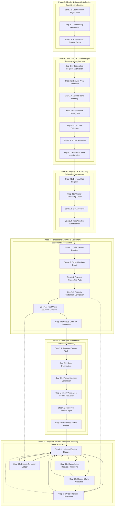

```mermaid
graph TD
    subgraph phase_01 [Phase 1: Identity & Context Initialization]
        subgraph init_core [Core System Context]
            init_root["Step 1.1: User Account Registration"]
            init_gate["Step 1.2: IAM Identity Verification"]
            init_auth["Step 1.3: Authenticated Session Token"]
        end
        init_root --> init_gate
        init_gate --> init_auth
    end

    subgraph phase_02 [Phase 2: Discovery & Curation Layer]
        subgraph discovery_core [Discovery & Staging State]
            disc_root["Step 2.1: Geolocation Request Submission"]
            disc_zone["Step 2.2: Service Area Validation"]
            disc_zone_fee["Step 2.3: Delivery Zone Mapping"]
            disc_pin["Step 2.4: Confirmed Delivery Pin"]
            disc_state["Step 2.5: Cart Item Selection"]
            disc_price["Step 2.6: Price Calculation"]
            disc_stock["Step 2.7: Real-Time Stock Confirmation"]
        end
        init_auth --> disc_root
        disc_root --> disc_zone
        disc_zone --> disc_zone_fee
        disc_zone_fee --> disc_pin
        disc_pin --> disc_state
        disc_state --> disc_price
        disc_price --> disc_stock
    end

    subgraph phase_03 [Phase 3: Logistics & Scheduling]
        subgraph logistics_core [Scheduling & Allocation]
            sched_root["Step 3.1: Delivery Slot Request"]
            sched_avail["Step 3.2: Courier Availability Check"]
            sched_alloc["Step 3.3: Slot Allocation"]
            sched_time["Step 3.4: Time-Window Enforcement"]
        end
        disc_stock --> sched_root
        sched_root --> sched_avail
        sched_avail --> sched_alloc
        sched_alloc --> sched_time
    end

    subgraph phase_04 [Phase 4: Transactional Commit & Settlement]
        subgraph transaction_core [Settlement & Finalization]
            trans_root["Step 4.1: Order Header Creation"]
            trans_item["Step 4.2: Order Line Item Detail"]
            trans_pay_auth["Step 4.3: Payment Transaction Auth"]
            trans_settle["Step 4.4: Financial Settlement Verification"]
            trans_final_doc["Step 4.5: Final Order Document Creation"]
            trans_receipt["Step 4.6: Unique Order ID Generation"]
        end
        sched_time --> trans_root
        trans_root --> trans_item
        trans_item --> trans_pay_auth
        trans_pay_auth --> trans_settle
        trans_settle --> trans_final_doc
        trans_final_doc --> trans_receipt
    end

    subgraph phase_05 [Phase 5: Execution & Handover]
        subgraph execution_core [Fulfillment & Delivery]
            exec_assign["Step 5.1: Assigned Courier Task"]
            exec_route["Step 5.2: Route Optimization"]
            exec_pickup["Step 5.3: Pickup Manifest Generation"]
            exec_verify["Step 5.4: Item Verification & Stock Deduction"]
            exec_handover["Step 5.5: Handover Receipt Input"]
            exec_complete["Step 5.6: Delivered Status Update"]
        end
        trans_receipt --> exec_assign
        exec_assign --> exec_route
        exec_route --> exec_pickup
        exec_pickup --> exec_verify
        exec_verify --> exec_handover
        exec_handover --> exec_complete
    end

    subgraph phase_06 [Phase 6: Lifecycle Closure & Exception Handling]
        subgraph closure_core [Global State Hub]
            closure_exit["Step 6.1: Universal System Closure"]
            exc_cancel["Step 6.2: Cancellation Request Processing"]
            exc_refund["Step 6.3: Refund Claim Validation"]
            exc_stock_release["Step 6.4: Stock Release Execution"]
            exc_dispute["Step 6.5: Dispute Reversal Ledger"]
        end
        closure_exit --> exc_cancel
        closure_exit --> exc_refund
        closure_exit --> exc_stock_release
        closure_exit --> exc_dispute
        exc_cancel --> closure_exit
        exc_refund --> closure_exit
        exc_stock_release --> closure_exit
        exc_dispute --> closure_exit
    end

    exc_cancel -.-> closure_exit
    exc_stock_release -.-> closure_exit
    exc_dispute -.-> closure_exit
    exec_complete --> closure_exit
    trans_settle -.-> exc_stock_release
    trans_final_doc -.-> exc_dispute
    exc_cancel -.-> exc_refund
    exc_refund -.-> exc_stock_release
```