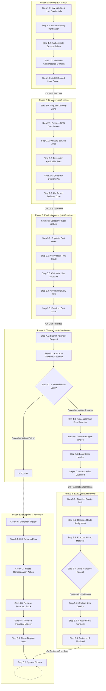

```mermaid
graph TD
    subgraph phase_01 [Phase 1: Identity & Curation]
        %% HUB & SPOKE ENTRY
        ph1_entry["Step 1.0: IAM Validates User Credentials"]
        
        ph1_step_1a["Step 1.1: Initiate Identity Verification"]
        ph1_step_1b["Step 1.2: Authenticate Session Token"]
        ph1_step_1c["Step 1.3: Establish Authenticated Context"]

        ph1_exit["Step 1.0: Authenticated User Context"]

        ph1_entry --> ph1_step_1a
        ph1_step_1a --> ph1_step_1b
        ph1_step_1b --> ph1_step_1c
        ph1_step_1c --> ph1_exit
    end

    subgraph phase_02 [Phase 2: Discovery & Curation]
        %% HUB & SPOKE ENTRY
        ph2_entry["Step 2.0: Request Delivery Zone"]

        ph2_step_2a["Step 2.1: Process GPS Coordinates"]
        ph2_step_2b["Step 2.2: Validate Service Area"]
        ph2_step_2c["Step 2.3: Determine Applicable Fees"]
        ph2_step_2d["Step 2.4: Generate Delivery Pin"]

        ph2_exit["Step 2.0: Confirmed Delivery Zone"]

        ph2_entry --> ph2_step_2a
        ph2_step_2a --> ph2_step_2b
        ph2_step_2b --> ph2_step_2c
        ph2_step_2c --> ph2_step_2d
        ph2_step_2d --> ph2_exit
    end

    subgraph phase_03 [Phase 3: Product Assembly & Curation]
        %% HUB & SPOKE ENTRY
        ph3_entry["Step 3.0: Select Products & Slots"]

        ph3_step_3a["Step 3.1: Populate Cart Items"]
        ph3_step_3b["Step 3.2: Verify Real-Time Stock"]
        ph3_step_3c["Step 3.3: Calculate Line Subtotals"]
        ph3_step_3d["Step 3.4: Allocate Delivery Slot"]

        ph3_exit["Step 3.0: Finalized Cart State"]

        ph3_entry --> ph3_step_3a
        ph3_step_3a --> ph3_step_3b
        ph3_step_3b --> ph3_step_3c
        ph3_step_3c --> ph3_step_3d
        ph3_step_3d --> ph3_exit
    end

    subgraph phase_04 [Phase 4: Transaction & Settlement]
        %% HUB & SPOKE ENTRY
        ph4_entry["Step 4.0: Submit Payment Request"]

        ph4_step_4a["Step 4.1: Authorize Payment Gateway"]
        ph4_decision_4{"Step 4.2: Is Authorization Valid?"}
        ph4_step_4b["Step 4.3: Process Secure Fund Transfer"]
        ph4_step_4c["Step 4.4: Generate Digital Invoice"]
        ph4_step_4d["Step 4.5: Lock Order Header"]

        ph4_exit["Step 4.0: Authorized & Captured"]

        ph4_entry --> ph4_step_4a
        ph4_step_4a --> ph4_decision_4
        ph4_decision_4 -- "On Authorization Failure" --> ph4_error
        ph4_decision_4 -- "On Authorization Success" --> ph4_step_4b
        ph4_step_4b --> ph4_step_4c
        ph4_step_4c --> ph4_step_4d
        ph4_step_4d --> ph4_exit
    end

    subgraph phase_05 [Phase 5: Execution & Handover]
        %% HUB & SPOKE ENTRY
        ph5_entry["Step 5.0: Dispatch Courier Task"]

        ph5_step_5a["Step 5.1: Optimize Route Assignment"]
        ph5_step_5b["Step 5.2: Execute Pickup Manifest"]
        ph5_decision_5{"Step 5.3: Verify Handover Receipt"}
        ph5_step_5c["Step 5.4: Confirm Item Quality"]
        ph5_step_5d["Step 5.5: Capture Final Payment"]

        ph5_exit["Step 5.0: Delivered & Finalized"]

        ph5_entry --> ph5_step_5a
        ph5_step_5a --> ph5_step_5b
        ph5_step_5b --> ph5_decision_5
        ph5_decision_5 -- "On Receipt Validation" --> ph5_step_5c
        ph5_step_5c --> ph5_step_5d
        ph5_step_5d --> ph5_exit
    end

    subgraph phase_06 [Phase 6: Exception & Recovery]
        %% HUB & SPOKE ENTRY
        ph6_entry["Step 6.0: Exception Trigger"]

        ph6_step_6a["Step 6.1: Halt Process Flow"]
        ph6_step_6b["Step 6.2: Initiate Compensation Action"]
        ph6_step_6c["Step 6.3: Release Reserved Stock"]
        ph6_step_6d["Step 6.4: Reverse Financial Ledger"]
        ph6_step_6e["Step 6.5: Close Dispute Loop"]

        ph6_exit["Step 6.0: System Closure"]

        ph6_entry --> ph6_step_6a
        ph6_step_6a --> ph6_step_6b
        ph6_step_6b --> ph6_step_6c
        ph6_step_6c --> ph6_step_6d
        ph6_step_6d --> ph6_step_6e
        ph6_step_6e --> ph6_exit
    end

    %% INTER-SUBGRAPH LINKS (Exit to Entrance)
    ph1_exit -- "On Auth Success" --> ph2_entry
    ph2_exit -- "On Zone Validated" --> ph3_entry
    ph3_exit -- "On Cart Finalized" --> ph4_entry
    ph4_exit -- "On Transaction Complete" --> ph5_entry
    ph5_exit -- "On Delivery Complete" --> ph6_exit

    %% EXCEPTION LINKS (Hard Failures to Exception Subgraph)
    ph4_error -.-> ph6_entry
    ph6_exit -.-> ph6_exit
```