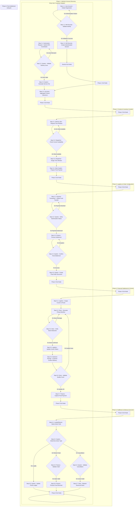

```mermaid
graph TD
    subgraph phase_01["Phase 1: Identity & Access Discovery"]
        subgraph entry_hub["Entry Hub: Customer Initiation"]
            init_root[Step 1.1: User Account - Initiate Registration]
            init_root --> auth_verify{"Step 1.2: IAM Security - Validate Identity"}
            auth_verify -- "On Authentication Failure" --> init_root
            auth_verify -- "On Validation Success" --> session_create["Step 1.3: IAM Security - Create Authenticated Session"]
            session_create --> session_exit["Session Exit Node"]
        end
        session_exit --> entry_exit["Phase 1 Exit Node"]
    end

    subgraph phase_02["Phase 2: Context & Inventory Curation"]
        subgraph entry_hub["Entry Hub: Zone & Cart Context"]
            entry_node[Step 2.1: Geolocation Request - Submit GPS Coordinates]
            entry_node --> zone_map{"Step 2.2: System - Validate Delivery Zone"}
            zone_map -- "On Zone Mismatch" --> entry_node
            zone_map -- "On Zone Valid" --> fee_cal["Step 2.3: System - Calculate Service Fee"]
            fee_cal --> cart_init["Step 2.4: Cart Item - Aggregate Product Selections"]
            cart_init --> cart_exit["Phase 2 Exit Node"]
        end
        entry_exit --> cart_init
        cart_exit --> phase_02_exit["Phase 2 Exit Node"]
    end

    subgraph phase_03["Phase 3: Logistics & Order Configuration"]
        subgraph entry_hub["Entry Hub: Slot & Order Header Setup"]
            slot_req[Step 3.1: Delivery Slot - Request Time Window]
            slot_req --> disp_avail{"Step 3.2: Dispatcher - Check Courier Availability"}
            disp_avail -- "On No Slots Available" --> slot_req
            disp_avail -- "On Slots Available" --> slot_alloc["Step 3.3: Dispatcher - Assign Time Window"]
            slot_alloc --> order_prep["Step 3.4: Order Header - Prepare Final Payload"]
            order_prep --> header_exit["Phase 3 Exit Node"]
        end
        phase_02_exit --> slot_req
        header_exit --> phase_03_exit["Phase 3 Exit Node"]
    end

    subgraph phase_04["Phase 4: Financial Settlement & Commit"]
        subgraph entry_hub["Entry Hub: Payment & Final Commit"]
            pay_init[Step 4.1: Payment Transaction - Initiate Fund Transfer]
            pay_init --> auth_check{"Step 4.2: System - Verify Authorization Status"}
            auth_check -- "On Payment Declined" --> pay_init
            auth_check -- "On Payment Authorized" --> settle_trans["Step 4.3: Finance - Process Settlement"]
            settle_trans --> settle_conf{"Step 4.4: System - Confirm Final Settlement"}
            settle_conf -- "On Exception" --> settle_trans
            settle_conf -- "On Success" --> doc_create["Step 4.5: System - Create Final Order Document"]
            doc_create --> settle_exit["Phase 4 Exit Node"]
        end
        phase_03_exit --> pay_init
        settle_exit --> phase_04_exit["Phase 4 Exit Node"]
    end

    subgraph phase_05["Phase 5: Fulfillment & Delivery Execution"]
        subgraph entry_hub["Entry Hub: Logistics & Handover"]
            assign_cour[Step 5.1: Logistics - Assign Courier to Route]
            assign_cour --> pickup_gen[Step 5.2: Store - Generate Pickup Manifest]
            pickup_gen --> stock_upd{"Step 5.3: Store - Verify Stock Deduction"}
            stock_upd -- "On Stock Shortage" --> pickup_gen
            stock_upd -- "On Stock Confirmed" --> cour_out["Step 5.4: Logistics - Update Courier Status"]
            cour_out --> handover_req[Step 5.5: Handover Receipt - Customer Confirm Delivery]
            handover_req --> qual_chk{"Step 5.6: Store - Validate Quality Count"}
            qual_chk -- "On Quality Issue" --> pickup_gen
            qual_chk -- "On Quality OK" --> final_cap["Step 5.7: Finance - Capture Final Payment"]
            final_cap --> handover_exit["Phase 5 Exit Node"]
        end
        phase_04_exit --> assign_cour
        handover_exit --> phase_05_exit["Phase 5 Exit Node"]
    end

    subgraph phase_06["Phase 6: Post-Settlement Lifecycle"]
        subgraph entry_hub["Entry Hub: Post-Order Actions"]
            post_node[Step 6.1: Loyalty/Refund - Select Action Path]
            post_node --> act_type{"Step 6.2: System - Determine Action Type"}
            act_type -- "On Refund Claim" --> refund_val{"Step 6.3: Finance - Validate Claim"}
            act_type -- "On Cancellation" --> cancel_val{"Step 6.4: System - Validate Cancellation"}
            act_type -- "On Loyalty" --> pts_upd["Step 6.5: System - Update Points Ledger"]
            refund_val -- "On Claim Valid" --> refund_proc["Step 6.6: Finance - Process Fund Reversal"]
            cancel_val -- "On Cancel Valid" --> stock_rel["Step 6.7: Store - Release Reserved Stock"]
            pts_upd --> life_cycle_end["Step 6.8: System - Close Transaction"]
            refund_proc --> life_cycle_end
            stock_rel --> life_cycle_end
        end
        phase_05_exit --> post_node
        life_cycle_end --> life_cycle_end["Phase 6 Exit Node"]
    end
```