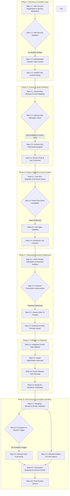

```mermaid
graph TD
    %%
    %% PHASE 1: DISCOVERY & CURATION LAYER
    %% Step 1.1: Identity Initiation & Verification
    subgraph phase_01 [Phase 1: Discovery & Curation Layer]
        entrance_01["Step 1.1: User Account Registration & Identity Verification"]
        iam_validate{"Step 1.2: IAM Security Validation"}
        auth_token["Step 1.3: Authenticated Session Token Issued"]
        exit_01["Step 1.4: Verified User Context Ready"]
    end

    %% PHASE 2: CONTEXT & SCOPE DEFINITION
    %% Step 2.1: Delivery Zone & Slot Allocation
    subgraph phase_02 [Phase 2: Context & Scope Definition]
        entrance_02["Step 2.1: Geolocation Request & Zone Mapping"]
        slot_request{"Step 2.2: Delivery Slot Allocation Check"}
        slot_assigned["Step 2.3: Delivery Slot Timestamp Assigned"]
        exit_02["Step 2.4: Service Zone & Slot Confirmed"]
    end

    %% PHASE 3: PRODUCT SELECTION & CART CURATION
    %% Step 3.1: Inventory Availability & Cart Construction
    subgraph phase_03 [Phase 3: Product Selection & Cart Curation]
        entrance_03["Step 3.1: Cart Item Selection & Inventory Query"]
        stock_check{"Step 3.2: Real-Time Stock Availability"}
        cart_updated["Step 3.3: Cart State Updated"]
        exit_03["Step 3.4: Confirmed Cart Contents"]
    end

    %% PHASE 4: TRANSACTION COMMIT & SETTLEMENT
    %% Step 4.1: Payment Authorization & Order Creation
    subgraph phase_04 [Phase 4: Transaction Commit & Settlement]
        entrance_04["Step 4.1: Order Header Submission & Payment Initiation"]
        payment_auth{"Step 4.2: Payment Transaction Authorization"}
        order_created["Step 4.3: Unique Order ID Created"]
        exit_04["Step 4.4: Authorized Order Receipt Issued"]
    end

    %% PHASE 5: FULFILLMENT & HANDOVER
    %% Step 5.1: Courier Assignment to Handover
    subgraph phase_05 [Phase 5: Fulfillment & Handover]
        entrance_05["Step 5.1: Assigned Courier Task Initiated"]
        route_opt["Step 5.2: Route Optimization Executed"]
        courier_active["Step 5.3: Active Delivery Task Running"]
        exit_05["Step 5.4: Ready for Handover Verification"]
    end

    %% PHASE 6: FINAL CLOSURE & EXCEPTION HANDLING
    %% Step 6.1: Completion, Balance Adjustment, or Rollback
    subgraph phase_06 [Phase 6: Final Closure & Exception Handling]
        entrance_06["Step 6.1: Handover Receipt & Quality Validation"]
        success_confirm["Step 6.2: Delivered Status & Final Capture"]
        dispute_check{"Step 6.3: Exception or Dispute Trigger"}
        refund_process["Step 6.4: Refund Claim Processing"]
        final_close["Step 6.5: Transaction Balanced & Account Closed"]
        exit_06["Step 6.6: Final System Closure"]
    end

    %%
    %% LINK STREAMS
    %% Phase 1 Internal
    entrance_01 --> iam_validate
    iam_validate -- "On Identity Verified" --> auth_token
    auth_token --> exit_01

    %% Phase 1 -> 2 Transition
    exit_01 --> entrance_02

    %% Phase 2 Internal
    entrance_02 --> slot_request
    slot_request -- "Slot Available & Courier Valid" --> slot_assigned
    slot_assigned --> exit_02

    %% Phase 2 -> 3 Transition
    exit_02 --> entrance_03

    %% Phase 3 Internal
    entrance_03 --> stock_check
    stock_check -- "Stock Confirmed" --> cart_updated
    cart_updated --> exit_03

    %% Phase 3 -> 4 Transition
    exit_03 --> entrance_04

    %% Phase 4 Internal (Transaction Logic)
    entrance_04 --> payment_auth
    payment_auth -- "Payment Authorized" --> order_created
    order_created --> exit_04

    %% Phase 4 -> 5 Transition
    exit_04 --> entrance_05

    %% Phase 5 Internal
    entrance_05 --> route_opt
    route_opt --> courier_active
    courier_active --> exit_05

    %% Phase 5 -> 6 Transition
    exit_05 --> entrance_06

    %% Phase 6 Internal (Success & Exception Logic)
    entrance_06 --> success_confirm
    entrance_06 --> dispute_check
    dispute_check -- "On Exception Trigger" --> refund_process
    refund_process --> final_close
    success_confirm --> final_close
    final_close --> exit_06
```