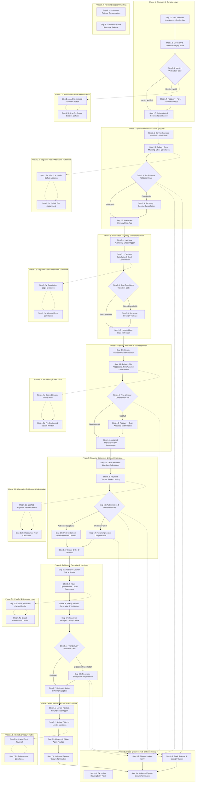

```mermaid
graph TD
    subgraph phase_01_a["Phase 1: Discovery & Curation Layer"]
        entrance_node_01["Step 1.1: IAM Validates User Account Credentials"]
        discovery_node_01["Step 1.2: Discovery & Curation Staging State"]
        decision_auth_01{"Step 1.3: Identity Verification Gate"}
        recovery_auth_01["Step 1.4: Recovery - Force Account Lockout"]
        exit_node_01["Step 1.5: Authenticated Session Token Issued"]
    end

    subgraph phase_01_b["Phase 1.1: Alternative/Parallel Identity Setup"]
        alt_identity_01["Step 1.1a: Admin Initiated Account Creation"]
        alt_session_01["Step 1.1b: Pre-Configured Session Default"]
    end

    subgraph phase_02_a["Phase 2: Spatial Verification & Zone Mapping"]
        entrance_node_02["Step 2.1: Service Interface Validates Geolocation"]
        validation_zone_02["Step 2.2: Delivery Zone Mapping & Fee Calculation"]
        decision_zone_02{"Step 2.3: Service Area Validation Gate"}
        recovery_zone_02["Step 2.4: Recovery - Session Cancellation"]
        exit_node_02["Step 2.5: Confirmed Delivery Pin & Fee"]
    end

    subgraph phase_02_b["Phase 2.2: Degraded Path / Alternative Fulfillment"]
        alt_zone_02["Step 2.2a: Historical Profile Default Location"]
        alt_fee_02["Step 2.2b: Default Fee Assignment"]
    end

    subgraph phase_03_a["Phase 3: Transaction Assembly & Inventory Check"]
        entrance_node_03["Step 3.1: Inventory Availability Check Trigger"]
        cart_calc_03["Step 3.2: Cart Item Calculation & Stock Confirmation"]
        decision_stock_03{"Step 3.3: Real-Time Stock Validation Gate"}
        recovery_stock_03["Step 3.4: Recovery - Inventory Release"]
        exit_node_03["Step 3.5: Updated Cart State with Stock"]
    end

    subgraph phase_03_b["Phase 3.2: Degraded Path / Alternative Fulfillment"]
        alt_stock_03["Step 3.2a: Substitution Logic Execution"]
        alt_price_03["Step 3.2b: Adjusted Price Calculation"]
    end

    subgraph phase_04_a["Phase 4: Logistics Allocation & Slot Assignment"]
        entrance_node_04["Step 4.1: Courier Availability Data Validation"]
        slot_alloc_04["Step 4.2: Delivery Slot Allocation & Time-Window Enforcement"]
        decision_slot_04{"Step 4.3: Time-Window Constraints Gate"}
        recovery_slot_04["Step 4.4: Recovery - Over-Allocated Slot Release"]
        exit_node_04["Step 4.5: Assigned Pickup/Delivery Timestamps"]
    end

    subgraph phase_04_b["Phase 4.2: Parallel Logic Execution"]
        alt_courier_04["Step 4.2a: Cached Courier Profile Hook"]
        alt_timestamp_04["Step 4.2b: Pre-Configured Default Window"]
    end

    subgraph phase_05_a["Phase 5: Financial Settlement & Order Finalization"]
        entrance_node_05["Step 5.1: Order Header & Line Item Submission"]
        payment_proc_05["Step 5.2: Payment Transaction Processing"]
        decision_auth_05{"Step 5.3: Authorization & Settlement Gate"}
        recovery_rollback_05["Step 5.4: Reversing Ledger Compensation"]
        commit_doc_05["Step 5.5: Post-Settlement Order Document Created"]
        exit_node_05["Step 5.6: Unique Order ID & Receipt"]
    end

    subgraph phase_05_b["Phase 5.2: Alternative Fulfillment & Substitution"]
        alt_payment_05["Step 5.2a: Cached Payment Method Default"]
        alt_invoice_05["Step 5.2b: Discounted Total Calculation"]
    end

    subgraph phase_06_a["Phase 6: Fulfillment Execution & Handover"]
        entrance_node_06["Step 6.1: Assigned Courier Task Activation"]
        route_opt_06["Step 6.2: Route Optimization & Driver Assignment"]
        pickup_task_06["Step 6.3: Pickup Manifest Generation & Verification"]
        handover_06["Step 6.4: Handover Receipt & Quality Check"]
        decision_final_06{"Step 6.5: Final Delivery Validation Gate"}
        recovery_final_06["Step 6.6: Recovery - Exception Compensation"]
        exit_node_06["Step 6.7: Delivered Status & Payment Capture"]
    end

    subgraph phase_06_b["Phase 6.2: Parallel & Degraded Logic"]
        alt_pickup_06["Step 6.3a: Store Associate Cached Profile"]
        alt_handover_06["Step 6.4a: Digital Confirmation Default"]
    end

    subgraph phase_07_a["Phase 7: Post-Transaction Lifecycle & Closure"]
        entrance_node_07["Step 7.1: Loyalty Points & Refund Logic Trigger"]
        claim_eval_07["Step 7.2: Refund Claim or Loyalty Validation"]
        finance_close_07["Step 7.3: Finance & Billing Agent Finalize"]
        system_close_07["Step 7.4: Universal System Closure Termination"]
    end

    subgraph phase_07_b["Phase 7.2: Alternative Closure Paths"]
        alt_refund_07["Step 7.2a: Partial Fund Reversal"]
        alt_loyalty_07["Step 7.2b: Point Accrual Calculation"]
    end

    subgraph phase_08_a["Phase 8: Global Exception Hub & Reconciliation"]
        entrance_node_08["Step 8.1: Exception Routing Entry Point"]
        disp_commit_08["Step 8.2: Dispute Ledger Entry"]
        sess_cancel_08["Step 8.3: Stock Release & Session Cancel"]
        system_close_08["Step 8.4: Universal System Closure Termination"]
    end

    subgraph phase_08_b["Phase 8.3: Parallel Exception Handling"]
        alt_dispute_08["Step 8.2a: Inventory Release Compensation"]
        alt_cancel_08["Step 8.3a: Unrecoverable Resource Release"]
    end

    entrance_node_01 --> discovery_node_01
    discovery_node_01 --> decision_auth_01
    decision_auth_01 -- "Identity Verified" --> exit_node_01
    decision_auth_01 -- "Identity Invalid" --> recovery_auth_01
    recovery_auth_01 --> exit_node_01

    exit_node_01 --> entrance_node_02
    entrance_node_02 --> validation_zone_02
    validation_zone_02 --> decision_zone_02
    decision_zone_02 -- "Zone Valid" --> exit_node_02
    decision_zone_02 -- "Zone Invalid" --> recovery_zone_02
    recovery_zone_02 --> exit_node_02

    exit_node_02 --> entrance_node_03
    entrance_node_03 --> cart_calc_03
    cart_calc_03 --> decision_stock_03
    decision_stock_03 -- "Stock Available" --> exit_node_03
    decision_stock_03 -- "Stock Unavailable" --> recovery_stock_03
    recovery_stock_03 --> exit_node_03

    exit_node_03 --> entrance_node_04
    entrance_node_04 --> slot_alloc_04
    slot_alloc_04 --> decision_slot_04
    decision_slot_04 -- "Slot Allocated" --> exit_node_04
    decision_slot_04 -- "Slot Full" --> recovery_slot_04
    recovery_slot_04 --> exit_node_04

    exit_node_04 --> entrance_node_05
    entrance_node_05 --> payment_proc_05
    payment_proc_05 --> decision_auth_05
    decision_auth_05 -- "Authorized/Captured" --> commit_doc_05
    decision_auth_05 -- "Declined/Failed" --> recovery_rollback_05
    commit_doc_05 --> exit_node_05
    recovery_rollback_05 --> exit_node_05

    exit_node_05 --> entrance_node_06
    entrance_node_06 --> route_opt_06
    route_opt_06 --> pickup_task_06
    pickup_task_06 --> handover_06
    handover_06 --> decision_final_06
    decision_final_06 -- "Delivered" --> exit_node_06
    decision_final_06 -- "Exception/Cancellation" --> recovery_final_06

    recovery_final_06 --> exit_node_06
    exit_node_06 --> entrance_node_07
    entrance_node_07 --> claim_eval_07
    claim_eval_07 --> finance_close_07
    finance_close_07 --> system_close_07

    decision_auth_05 -.-> disp_commit_08
    decision_slot_04 -.-> disp_commit_08
    decision_zone_02 -.-> disp_commit_08
    recovery_final_06 -.-> disp_commit_08
    recovery_rollback_05 -.-> disp_commit_08

    decision_auth_05 -.-> sess_cancel_08
    recovery_final_06 -.-> sess_cancel_08
    decision_zone_02 -.-> sess_cancel_08

    disp_commit_08 --> system_close_08
    sess_cancel_08 --> system_close_08
    system_close_07 --> system_close_08

    decision_auth_01 -.-> alt_identity_01
    alt_identity_01 -.-> alt_session_01

    validation_zone_02 -.-> alt_zone_02
    alt_zone_02 -.-> alt_fee_02

    cart_calc_03 -.-> alt_stock_03
    alt_stock_03 -.-> alt_price_03

    slot_alloc_04 -.-> alt_courier_04
    alt_courier_04 -.-> alt_timestamp_04

    payment_proc_05 -.-> alt_payment_05
    alt_payment_05 -.-> alt_invoice_05

    route_opt_06 -.-> alt_pickup_06
    alt_pickup_06 -.-> alt_handover_06

    claim_eval_07 -.-> alt_refund_07
    alt_refund_07 -.-> alt_loyalty_07

    alt_identity_01 -.-> alt_session_01
    alt_zone_02 -.-> alt_fee_02
    alt_stock_03 -.-> alt_price_03
    alt_courier_04 -.-> alt_timestamp_04
    alt_payment_05 -.-> alt_invoice_05
    alt_pickup_06 -.-> alt_handover_06
    alt_refund_07 -.-> alt_loyalty_07
```