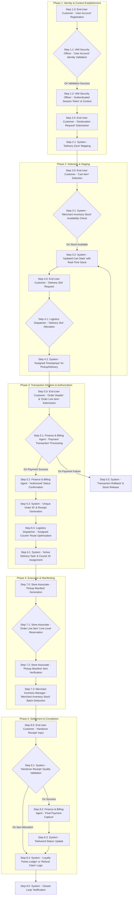

```mermaid
graph TD
    subgraph phase_01 [Phase 1: Identity & Context Establishment]
        entry_customer["Step 1.0: End-User Customer - 'User Account' Registration"]
        iam_audit{"Step 1.1: IAM Security Officer - 'User Account' Identity Validation"}
        session_token["Step 1.2: IAM Security Officer - 'Authenticated Session Token' & Context"]
        geo_request["Step 2.0: End-User Customer - 'Geolocation Request' Submission"]
        zone_map["Step 2.1: System - 'Delivery Zone' Mapping"]
    end

    subgraph phase_02 [Phase 2: Selection & Staging]
        entry_staging["Step 3.0: End-User Customer - 'Cart Item' Selection"]
        stock_check{"Step 3.1: System - 'Merchant Inventory Stock' Availability Check"}
        cart_state["Step 3.2: System - 'Updated Cart State' with Real-Time Stock"]
        slot_req["Step 4.0: End-User Customer - 'Delivery Slot' Request"]
        slot_alloc{"Step 4.1: Logistics Dispatcher - 'Delivery Slot' Allocation"}
        timestamps["Step 4.2: System - 'Assigned Timestamps' for Pickup/Delivery"]
    end

    subgraph phase_03 [Phase 3: Transaction Initiation & Authorization]
        entry_order["Step 5.0: End-User Customer - 'Order Header' & 'Order Line Item' Submission"]
        payment_proc{"Step 5.1: Finance & Billing Agent - 'Payment Transaction' Processing"}
        fund_auth["Step 5.2: Finance & Billing Agent - 'Authorized' Status Confirmation"]
        order_id["Step 5.3: System - 'Unique Order ID' & Receipt Generation"]
        log_opt["Step 6.0: Logistics Dispatcher - 'Assigned Courier' Route Optimization"]
        courier_id["Step 6.1: System - 'Active Delivery Task' & Courier ID Assignment"]
    end

    subgraph phase_04 [Phase 4: Execution & Manifesting]
        entry_manifest["Step 7.0: Store Associate - 'Pickup Manifest' Generation"]
        stock_reserve{"Step 7.1: Store Associate - 'Order Line Item' Line-Level Reservation"}
        physical_pick["Step 7.2: Store Associate - 'Pickup Manifest' Item Verification"]
        final_stock["Step 7.3: Merchant Inventory Manager - 'Merchant Inventory Stock' Batch Deduction"]
    end

    subgraph phase_05 [Phase 5: Settlement & Completion]
        entry_handover["Step 8.0: End-User Customer - 'Handover Receipt' Input"]
        handover_check{"Step 8.1: System - 'Handover Receipt' Quality Validation"}
        final_cap["Step 8.2: Finance & Billing Agent - 'Final Payment Capture'"]
        delivered_status["Step 8.3: System - 'Delivered Status' Update"]
        post_actions["Step 8.4: System - 'Loyalty Points Ledger' or 'Refund Claim' Logic"]
    end

    entry_customer --> iam_audit
    iam_audit -- "On Validation Success" --> session_token
    session_token --> geo_request
    geo_request --> zone_map
    zone_map --> entry_staging
    entry_staging --> stock_check
    stock_check -- "On Stock Available" --> cart_state
    cart_state --> slot_req
    slot_req --> slot_alloc
    slot_alloc --> timestamps
    timestamps --> entry_order
    entry_order --> payment_proc
    payment_proc -- "On Payment Failure" --> rollback_error["Step 5.5: System - 'Transaction Rollback' & Stock Release"]
    rollback_error --> cart_state
    payment_proc -- "On Payment Success" --> fund_auth
    fund_auth --> order_id
    order_id --> log_opt
    log_opt --> courier_id
    courier_id --> entry_manifest
    entry_manifest --> stock_reserve
    stock_reserve --> physical_pick
    physical_pick --> final_stock
    final_stock --> entry_handover
    entry_handover --> handover_check
    handover_check -- "On Item Mismatch" --> post_actions
    handover_check -- "On Success" --> final_cap
    final_cap --> delivered_status
    delivered_status --> post_actions
    post_actions --> end_state["Step 9.0: System - 'Closed Loop' Notification"]
```