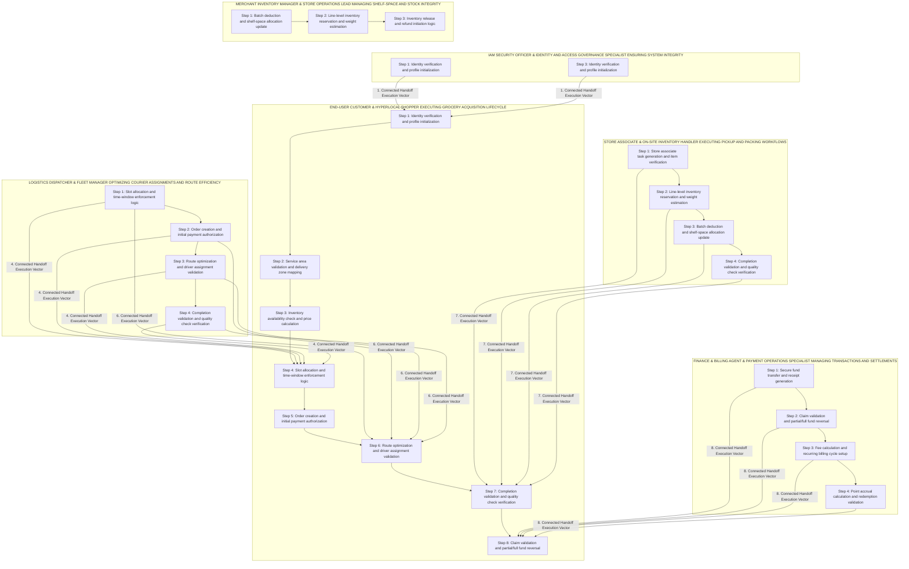

```mermaid
graph TD
    %% ============================================================================
    %% ENTERPRISE CROSS-FUNCTIONAL SWIMLANE AUTHORIZATION ARCHITECTURE MAP
    %% ============================================================================

    subgraph lane_0 ["END-USER CUSTOMER & HYPERLOCAL SHOPPER EXECUTING GROCERY ACQUISITION LIFECYCLE"]
        step_end_user_customer_1["Step 1: Identity verification and profile initialization"]
        step_end_user_customer_2["Step 2: Service area validation and delivery zone mapping"]
        step_end_user_customer_3["Step 3: Inventory availability check and price calculation"]
        step_end_user_customer_4["Step 4: Slot allocation and time-window enforcement logic"]
        step_end_user_customer_5["Step 5: Order creation and initial payment authorization"]
        step_end_user_customer_6["Step 6: Route optimization and driver assignment validation"]
        step_end_user_customer_7["Step 7: Completion validation and quality check verification"]
        step_end_user_customer_8["Step 8: Claim validation and partial/full fund reversal"]
    end

    subgraph lane_1 ["STORE ASSOCIATE & ON-SITE INVENTORY HANDLER EXECUTING PICKUP AND PACKING WORKFLOWS"]
        step_store_associate_1["Step 1: Store associate task generation and item verification"]
        step_store_associate_2["Step 2: Line-level inventory reservation and weight estimation"]
        step_store_associate_3["Step 3: Batch deduction and shelf-space allocation update"]
        step_store_associate_4["Step 4: Completion validation and quality check verification"]
    end

    subgraph lane_2 ["LOGISTICS DISPATCHER & FLEET MANAGER OPTIMIZING COURIER ASSIGNMENTS AND ROUTE EFFICIENCY"]
        step_logistics_dispatcher_1["Step 1: Slot allocation and time-window enforcement logic"]
        step_logistics_dispatcher_2["Step 2: Order creation and initial payment authorization"]
        step_logistics_dispatcher_3["Step 3: Route optimization and driver assignment validation"]
        step_logistics_dispatcher_4["Step 4: Completion validation and quality check verification"]
    end

    subgraph lane_3 ["MERCHANT INVENTORY MANAGER & STORE OPERATIONS LEAD MANAGING SHELF-SPACE AND STOCK INTEGRITY"]
        step_merchant_inventory_manager_1["Step 1: Batch deduction and shelf-space allocation update"]
        step_merchant_inventory_manager_2["Step 2: Line-level inventory reservation and weight estimation"]
        step_merchant_inventory_manager_3["Step 3: Inventory release and refund initiation logic"]
    end

    subgraph lane_4 ["IAM SECURITY OFFICER & IDENTITY AND ACCESS GOVERNANCE SPECIALIST ENSURING SYSTEM INTEGRITY"]
        step_iam_security_officer_1["Step 1: Identity verification and profile initialization"]
        step_iam_security_officer_3["Step 3: Identity verification and profile initialization"]
    end

    subgraph lane_5 ["FINANCE & BILLING AGENT & PAYMENT OPERATIONS SPECIALIST MANAGING TRANSACTIONS AND SETTLEMENTS"]
        step_finance___billing_agent_1["Step 1: Secure fund transfer and receipt generation"]
        step_finance___billing_agent_2["Step 2: Claim validation and partial/full fund reversal"]
        step_finance___billing_agent_3["Step 3: Fee calculation and recurring billing cycle setup"]
        step_finance___billing_agent_4["Step 4: Point accrual calculation and redemption validation"]
    end

    %% --- FORCE INVISIBLE HORIZONTAL ALIGNMENT CONSTRAINTS (SIDE-BY-SIDE) ---
    lane_0 ~~~ lane_1
    lane_1 ~~~ lane_2
    lane_2 ~~~ lane_3
    lane_3 ~~~ lane_4
    lane_4 ~~~ lane_5

    %% --- ENTERPRISE INTER-SWIMLANE CROSS-BOUNDARY PIPELINE CHANNELS ---
    step_iam_security_officer_1 -- " 1. Connected Handoff Execution Vector " --> step_end_user_customer_1
    step_iam_security_officer_3 -- " 1. Connected Handoff Execution Vector " --> step_end_user_customer_1
    step_end_user_customer_1 --> step_end_user_customer_2
    step_end_user_customer_2 --> step_end_user_customer_3
    step_end_user_customer_3 --> step_end_user_customer_4
    step_logistics_dispatcher_1 -- " 4. Connected Handoff Execution Vector " --> step_end_user_customer_4
    step_logistics_dispatcher_2 -- " 4. Connected Handoff Execution Vector " --> step_end_user_customer_4
    step_logistics_dispatcher_3 -- " 4. Connected Handoff Execution Vector " --> step_end_user_customer_4
    step_logistics_dispatcher_4 -- " 4. Connected Handoff Execution Vector " --> step_end_user_customer_4
    step_end_user_customer_4 --> step_end_user_customer_5
    step_end_user_customer_5 --> step_end_user_customer_6
    step_logistics_dispatcher_1 -- " 6. Connected Handoff Execution Vector " --> step_end_user_customer_6
    step_logistics_dispatcher_2 -- " 6. Connected Handoff Execution Vector " --> step_end_user_customer_6
    step_logistics_dispatcher_3 -- " 6. Connected Handoff Execution Vector " --> step_end_user_customer_6
    step_logistics_dispatcher_4 -- " 6. Connected Handoff Execution Vector " --> step_end_user_customer_6
    step_end_user_customer_6 --> step_end_user_customer_7
    step_store_associate_1 -- " 7. Connected Handoff Execution Vector " --> step_end_user_customer_7
    step_store_associate_2 -- " 7. Connected Handoff Execution Vector " --> step_end_user_customer_7
    step_store_associate_3 -- " 7. Connected Handoff Execution Vector " --> step_end_user_customer_7
    step_store_associate_4 -- " 7. Connected Handoff Execution Vector " --> step_end_user_customer_7
    step_end_user_customer_7 --> step_end_user_customer_8
    step_finance___billing_agent_1 -- " 8. Connected Handoff Execution Vector " --> step_end_user_customer_8
    step_finance___billing_agent_2 -- " 8. Connected Handoff Execution Vector " --> step_end_user_customer_8
    step_finance___billing_agent_3 -- " 8. Connected Handoff Execution Vector " --> step_end_user_customer_8
    step_finance___billing_agent_4 -- " 8. Connected Handoff Execution Vector " --> step_end_user_customer_8
    step_store_associate_1 --> step_store_associate_2
    step_store_associate_2 --> step_store_associate_3
    step_store_associate_3 --> step_store_associate_4
    step_logistics_dispatcher_1 --> step_logistics_dispatcher_2
    step_logistics_dispatcher_2 --> step_logistics_dispatcher_3
    step_logistics_dispatcher_3 --> step_logistics_dispatcher_4
    step_merchant_inventory_manager_1 --> step_merchant_inventory_manager_2
    step_merchant_inventory_manager_2 --> step_merchant_inventory_manager_3
    step_finance___billing_agent_1 --> step_finance___billing_agent_2
    step_finance___billing_agent_2 --> step_finance___billing_agent_3
    step_finance___billing_agent_3 --> step_finance___billing_agent_4
```