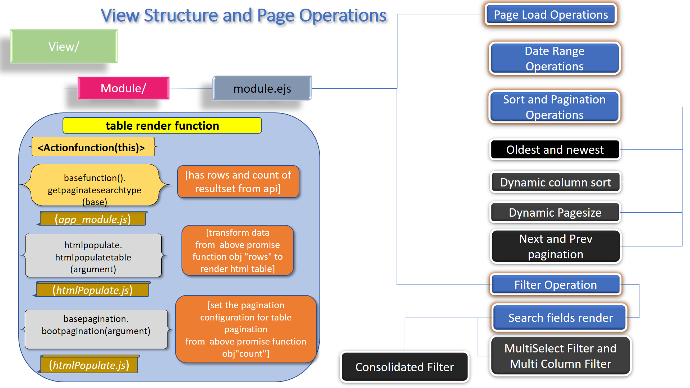
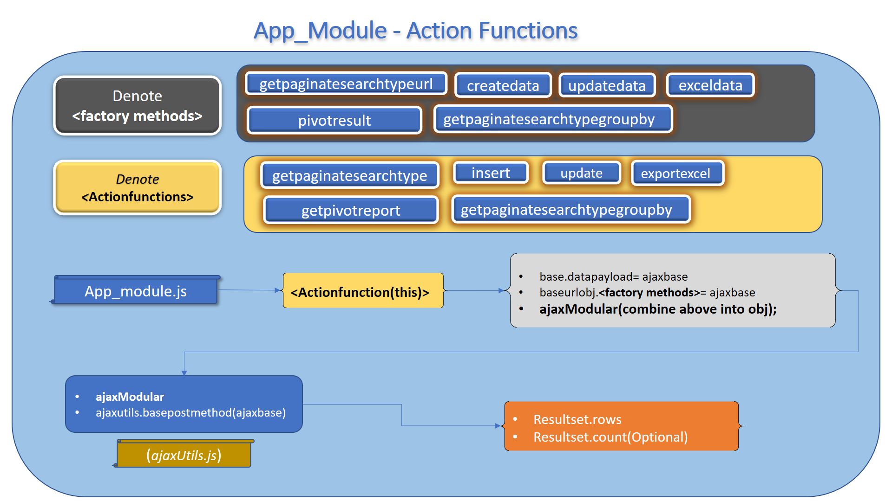

### Badges

### Tech stacks

 
🚄 Problem Statement 
<blockquote>

 
<!--<table class="tg">
<thead>
  <tr>
    <td class="tg-0pky">Who </td>
    <td class="tg-0pky">Who has the problem? </td>
    <td class="tg-0pky"> Any Dev or Dev Team building project from Scratch or Migrating Existing Piece  </td>
  </tr>
</thead>
<tbody>
  <tr>
    <td class="tg-0pky">What</td>
    <td class="tg-0pky">What is the problem?</td>
    <td class="tg-0pky">Conventional scaffolding / boilerplate does not cater to all  Key outcomes pointers</td>
  </tr>
  <tr>
    <td class="tg-0pky">Where</td>
    <td class="tg-0pky">When/Where the problem is occurring?</td>
    <td class="tg-0pky">During any project execution stage and even in planning phase  Team Has to spend a lot time and energy to plan, discuss and execute the project key outcomes mentioned as part of *solution statement*  mentioned above and thus planning and execution are pain points.</td>
  </tr>
  <tr>
    <td class="tg-0pky">Why</td>
    <td class="tg-0pky">why is it important to address?</td>
    <td class="tg-0pky">It is important to address because it would save time , energy of team members which in turn cascades  to finances, deadlines and other Factors.  </td>
  </tr>
</tbody>
</table>
 -->
 

🚀 Solution Statement- Key Outcomes

<blockquote>
   
  

 
🨠Objective 
<blockquote>

   

 
🰠Mandates 
<blockquote>

    

 
🦠Features/Functionalities : Conventional Levels
<blockquote>

 
🧠Features/Functionalities : Advanced Levels
<blockquote>

 
🫠
 Scope Statement
 
<blockquote>

📡  Platform Setup 

<blockquote>
   

🍕sh file Setup

> *`chmod +x ./app/utils/serverSetup/primarySetup.sh `*  

> *`sed -i -e 's/\r$//' ./app/utils/serverSetup/> primarySetup.sh`*

>*`chmod +x ./app/utils/serverSetup/secondarySetup.sh`*

>*`sed -i -e 's/\r$//' ./app/utils/serverSetup/secondarySetup.sh`*

>*`bash ./app/utils/serverSetup/primarySetup.sh`*

   

> _`Please note if you have node/postgres/redis server installed in your instance/machine. Please comment the install information in primarySetup.sh file and then run this file`_

  
  

🍤app Setup

  
> **node,postgres, redis and app dependencies  installation**

>*`bash ./app/utils/serverSetup/primarySetup.sh`*

>*`bash ./app/utils/serverSetup/secondarySetup.sh`*

🍔 mocha chai tests against 20,00,000 recordsets

> _`npm run LoginEval or yarn LoginEval`_

> _`npm run ModuleEval or yarn ModuleEval`_

🍟 app Run

>*`npm run app or yarn app `*

🍩 app Usage

>*`goto localhost:3011/employees`*

>*`username : krennic and  password:orson`*

>*`select birthdate from dropdown and select date range any from 1982 to till date`*

 🍜 app SuperAdmin Usage

>*`goto localhost:3011/black-squadron`*

>*`username : krennic and password:orson`*

>*`for any other controls other than textbox it is mandatory`*

>*`to enter PIPE "|" separator in textbox column for e.g genderid|gendername`*

 🍘 API Documentation Usage(Swagger)

>*`goto localhost:3011/getAccessToken`*

>*`Click on Get AccessToken button and copy the newly generated Access Token`*

>*`goto localhost:3012/api-docs`*

>*`Click on authorize and paste the access Token`*

 
💈 Walkthroughs : Features/Functionalities 

 <blockquote>
  

    
🇠Dynamic pivot operation from Postgres with highchart implementation (Redis Cached)

  

 

 
🊠Node.js stream based CSV download for more than 1000k recordsets from PostgresSQL with socket.io as progress feature

 

  

 

 
👠Automated Swagger for each Module created By build in scaffoding accessed at http://localhost:3012/api-docs/ 

 

  

 

 
ğŸ Basic dashboard operation

 

 

 
📠Boilerplate walkthrough with multi control(Radio and Checkbox-Data from respective db tables) with Automated mocha test Cases

 

 

 
ğŸ Boilerplate walkthrough with multi control(Radio-Data from respective db table) with Automated mocha test Cases

 

 

🤖 Deliverables Timeline

<blockquote>
   
  

 
🥑 2022 
<blockquote>

   

 
🌽 2021 
<blockquote>

    

 
🄠2020
<blockquote>

#### 
 

 
🫠Releases
<blockquote>

- ### `Release notes 23 July 2022`

  >Optimized Dynamic Multi Column , Multi Select  filter from 5 secs to 16 ms for 2   million rows . 
  >[My stack overflow solution](https://stackoverflow.com/a/73085784/1333794)
   

- ### `Release notes 21 July 2022`

  >base and pivot Operation optimized
  
  >incremental load (pagination section loaded after report rendered) for base report
  
  >incremental load (pagination section loaded after report rendered) for pivot report   

- ### `Release notes 19 July 2022`

  >github actions
  >Integrated CI-workflows with redis, postgres for automation mocha test cases
  >
  >[Github Action - Automation mocha test cases](https://github.com/matt212/Nodejs_Postgresql_VanillaJS_Fastify/runs/7475512509?check_suite_focus=true )
   
- ### `Release notes 18 July 2022`

  >Implemented basic dark theme   

- ### `Release notes 17 July 2022`

  >Implemented Redis based Server-Side Caching for Pivot Operations  

- ### `Release notes 1 July 2022`

> **Superadmin scaffolding/ boilerplate Access URL**
 > *http://localhost:3011/black-squadron*
 
 > _`username : krennic and password:orson`_

 >`for any other controls other than textbox it is mandatory `

 >` to enter PIPE "|" separator in textbox column for e.g genderid|gendername` 

- ### `Release notes 11 Feb 2021`

  >boilerplate for multiselect integration with radio and checkboxes completed 

- ### `Release notes 09 Feb 2021`

  >Applied in  boilerplate multi and single select Dynamic SQLConstruct with 360 degree coverage 

- ### `Release notes 06 Feb 2021`

  >for boilerplate multi and single select static mapping for edit and default rendering case scenarios completed
  
- ### `Release notes 29 Jan 2021`

  >validations applied for bolierplate dynamic radio button and checkboxes with 

- ### `Release notes 27 Jan 2021`

  >applied multi control for radio scaffolding 
 
- ### `Release notes 20 Jan 2021`

  >For rbac test cases modularized

  > `yarn mroleEval`

  > `yarn userroleEval`

- ### `Release notes 9 Jan 2021`

  >For rbac user-Role Mapping  module migrated to fastify with its 35 mocha chai test cases respectively 

  > `yarn mroleEval`

  > `yarn userroleEval`

- ### `Release notes 22 Dec 2020`
  >Dynamic Bolierplate generation completed for dataType Strings , Integers and BigInt data types config based
  
  >For rbac modname,muser modules migrated to fastify with their respective 43 and 63 mocha chai test cases
  
  >For rbac role module migrated to fastify with its 43 mocha chai test cases
  > `yarn ModEval`
  > `yarn roleEval`
 
- ### `Release notes 21 Dec 2020`
  > 73 **Modular** Mocha test cases against 20,00,000 recordset with 360 coverage including schema,NaN,Undefined,Multi Column Search,Multi Select,Pivot X and Y for pageSize and pageNo  payload Validations
  
  > `yarn ModuleEval`

- ### `Release notes 20 Dec 2020`
  > 73 **Modular** Mocha test cases against 20,00,000 recordset with 360 coverage including schema,NaN,Undefined,Multi Column Search,Multi Select,Pivot X and Y for pageSize and pageNo  payload Validations
  > `yarn ModuleEval`

- ### `Release notes 11 Dec 2020`
  > basic login tests are written and can view and evaluated by running below command
  > `yarn LoginEval`

- ### `Release notes 10 Dec 2020`
  > run `yarn perfgraph`
  > in new shell run autocannon `yarn customAutocannon`
  > when autocannon bench is completed go back to perfgraph shell and stop the shell (ctlrl+C)
  > it will generate graph html link in same perfgraph shell

- ### `Release notes 7 Dec 2020`
  > made date filter optional with code refractoring by introducing `disableDate=true` arguement in API payload.

  

 

 

 🚠Project Statement 
<blockquote>

<!-- 

 -->

 

 🛰️ Architecture 

<blockquote>

 🌯 Server Side 

<blockquote>

 
🥠Route Structure Module Operations 

 

 
🥗 Module View (EJS) Render 

 

 
🲠Module Load Operations 

 

 
🟠Multipurpose Features Operations 

 

 
🧆 Groupby Operations 

 

 
🥠Create Operation 

 

 
🥨 Update Operations 

 

 
🥖 ETL Upload Operations 

 

 
🥠ETL Download Operations 

 

 
🳠Api Cache Operations

 

 
🥙 Api Cache Operations-Drilldown

 

<!--client side -->

 

 🛸 Client Side 

<blockquote>

 
✈️ View Structure and Page Operations 

 

 
🛩️ Page Load and Date Range Operations 

 

 

🛶 Sort and Pagination Operations 

 

 
🪂 Filter Operations 

 

 
⛵ Create and Update Operations 

 

 
⛴️ Field Validations 

 

 
🚤 Field Validations-Event listeners 

 

 
🤿 App Module-ActionFunctions 

 

 
🛷 Pivot Operations 

 

 
🏝️ ETL upload Operations 

 

 
🱠ETL download user Actions

 

 
🣠ETL download Operations

 

 

 ğŸ Release Flow 

<blockquote>

 
🥥 Nodejs Web App Env Release Mechanism Pt-1 

 

 
💠Nodejs Web App Env Release Mechanism Pt-2 

 

 

🌠How to Release Node App 

 

  
 

#### 🍱Reach out to me 🍝 🍤

